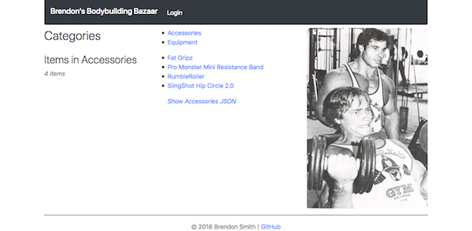
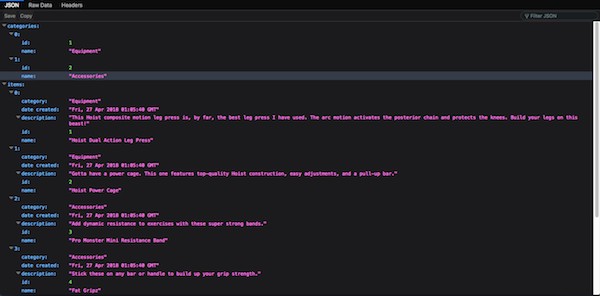
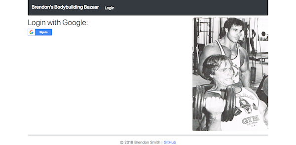
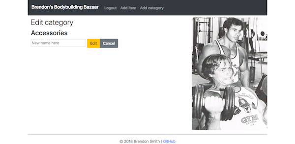
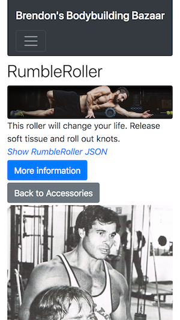

# README

<a href="https://www.udacity.com/">
  
</a>

Udacity Full Stack Web Developer Nanodegree program

[Project 4. Flask Item Catalog App](https://github.com/br3ndonland/udacity-fsnd-p4-flask-catalog)

Brendon Smith

br3ndonland

Python Flask CRUD web app with SQLite DB, Google Sign-In, and JSON API

[](https://choosealicense.com/)

## Table of Contents <!-- omit in toc -->

- [Description](#description)
- [Repository contents](#repository-contents)
- [Instructions](#instructions)
  - [Generate credentials](#generate-credentials)
  - [Set up environment](#set-up-environment)
  - [Run application](#run-application)
- [Deployment](#deployment)
  - [Linux Apache server](#linux-apache-server)
  - [Docker](#docker)
- [Tips](#tips)

## Description

- This is a [RESTful](https://ruben.verborgh.org/blog/2012/08/24/rest-wheres-my-state/) web application created with [Python 3](https://docs.python.org/3/) and the Python micro-framework [Flask](http://flask.pocoo.org/).
- The app's [SQLite](https://sqlite.org/index.html) database contains a catalog of items and associated information. The app is called "Brendon's Bodybuilding Bazaar" and features items useful for bodybuilding. The database is created by running [database_setup.py](database_setup.py) and populated by running [database_data.py](database_data.py).
- The SQLite database is accessed by [SQLAlchemy](http://www.sqlalchemy.org/) from within the Python code in [application.py](application.py).
- The main application code is located in [application.py](application.py). This file controls the app, with Flask routing functions to render the pages of the web application and access app content.
- Authentication is performed with a hybrid flow. The [deprecated `oauth2client` library](https://google-auth.readthedocs.io/en/latest/oauth2client-deprecation.html) was used for consistency with the Udacity Vagrant virtual machine configuration. Future implementations should consider using [`google-auth`](https://google-auth.readthedocs.io/en/latest/index.html) or [`authlib`](https://docs.authlib.org/en/latest/index.html).
- Python code has been formatted according to the [PEP 8](http://pep8.org/) specification. Comments and spacing keep the code as organized and readable as possible.
- Markdown documents in the repository have been formatted in a standard style, based on suggestions from [vscode-markdownlint](https://github.com/DavidAnson/vscode-markdownlint).
- The application pages are styled with [Bootstrap 4](https://getbootstrap.com), a library of HTML, CSS, and JavaScript components.
- The homepage displays a navbar, the item categories, the items most recently added to the database, and an awesome classic picture of Arnold Schwarzenegger and Franco Columbu.

  

- Clicking on a category name displays the items in the category.

  

- Clicking on an item provides a photo, description, and link.

  

- JSON data for each page can be accessed by clicking the JSON links, which append `/json` to the URL.

  

- Clicking Sign In allows the user to authenticate with Google.

  

- Users who are logged in can add items and categories. The creator of each item or category can also edit or delete it.

  

- The app is fully responsive, thanks to Bootstrap.

  

[(Back to top)](#top)

## Repository contents

- [.vscode](.vscode)
  - [launch.json](.vscode/launch.json): Configuration file for running and debugging Python files from within vscode.
  - [settings.json](.vscode/settings.json): vscode settings override for this repository.
- [info/](info)
  - [img/](info/img): Images used in documentation.
  - [flask-catalog-methods.md](info/flask-catalog-methods.md): Computational narrative detailing the app creation process.
  - [flask-catalog-review.md](info/flask-catalog-review.md): Code review.
  - [flask-catalog-udacity-docs.md](info/flask-catalog-udacity-docs.md): Udacity documentation for the project.
- [static/](static)
  - [img/](static/img): Images used in the main application.
- [templates/](templates): HTML webpage templates.
- [venv](venv): Files for Python virtual environment.
- [.dockerignore](.dockerignore): Instructions to Docker to exclude certain files from container builds.
- [.gitignore](.gitignore): Instructions to Git to exclude certain files from commits.
- [application.py](application.py): Main Flask app Python file.
- [database_data.py](database_data.py): Python file used to populate the database.
- [database_setup.py](database_setup.py): Python file used to configure the database.
- [Dockerfile](Dockerfile): Docker container build instructions.
- [LICENSE](LICENSE): This file describes how the repository can be used by others. I have provided the repository under the MIT license, a permissive and widely-used license. See the [choose a license page](https://choosealicense.com/) for more info on licenses.
- [README.md](README.md): This file, a concise description of the project.
- [requirements.txt](requirements.txt): List of Python packages installed by pip.

<!-- - [Pipfile](Pipfile): List of Python dependencies for the Pipenv virtual environment. -->
<!-- - [Pipfile.lock](Pipfile.lock): An extended version of the Pipfile containing hashes and other specific information for Pipenv. -->

[(Back to top)](#top)

## Instructions

### Generate credentials

- This application will require an OAuth 2.0 client ID from the Google API dashboard.
- Log into Google.
- Navigate to the [Google Cloud Platform APIs credentials page](https://console.cloud.google.com/apis/credentials).
- Click `Create credentials` and follow the prompts.
  - OAuth Client ID
  - Web application
  - Set a name. I set mine as "Brendon's Bodybuilding Bazaar".
  - Restrictions: Add `http://localhost:8000` to the Authorized JavaScript origins and Redirects.
- Download JSON credentials and save in application directory as *client_secrets.json*.

### Set up environment

The application can be run by setting up either a virtual environment or a virtual machine. Instructions for each option are provided below.

#### Major dependencies

- Python 3
- Flask
- Requests
- SQLAlchemy
- oauth2client

#### Virtual environment with venv

Python 3 is bundled with the `venv` module for creation of virtual environments.

```shell
cd <PATH>
python3 -m venv venv
# activate virtual env
. venv/bin/activate
# install modules listed in requirements.txt
(venv) <PATH> pip install -r requirements.txt
```

<!--
#### Virtual environment with Pipenv

[Pipenv](https://docs.pipenv.org/) can be used to manage a Python virtual environment for this project. The user must first install Pipenv via Homebrew or pip. After changing into the project directory, running `pipenv install` will prompt Pipenv to read the Pipfile and install dependencies.

```shell
pip install --user pipenv
cd <PATH>/udacity-fsnd-p4-flask-catalog
pipenv install
```

The virtual environment can then be activated with `pipenv shell`, which spawns a subshell for the virtual environment. Python files can be run from the Pipenv subshell prompt. The subshell can be exited by simply entering `exit`.

The vscode configuration is also included to specify the virtual environment and enable debugging from within vscode. At the time this application was written (April 2018), support for Pipenv within vscode was still [under active development](https://github.com/Microsoft/vscode-python/issues/1238).

Proceed to the [run application instructions below](#run-application).
-->

#### Virtual machine

A virtual machine can be used to run the code from an operating system with a defined configuration. The virtual machine has all the dependencies needed to run the application.

##### Configure virtual machine

I wrote the program in a Linux virtual machine with the following components:

- Oracle [VirtualBox](https://www.virtualbox.org) Version 5.2.10 r122088 (Qt5.6.3)
  - Software that runs special containers called virtual machines, like Vagrant.
  - Updates to the program need to be [downloaded directly](https://www.virtualbox.org/wiki/Downloads).
- [Vagrant](https://www.vagrantup.com/) 2.0.4 with Ubuntu 16.04.4 LTS (GNU/Linux 4.4.0-75-generic x86_64)
  - Software that provides the Linux operating system in a defined configuration, allowing it to run identically across many personal computers. Linux can then be run as a virtual machine with VirtualBox.
  - Updates to the program need to be [downloaded directly](https://www.vagrantup.com/downloads.html).
- [Udacity virtual machine configuration](https://github.com/udacity/fullstack-nanodegree-vm)
  - Repository from Udacity that configures Vagrant.
  - Some of the necessary Python modules in the Udacity virtual machine configuration are only included for Python 2, and not Python 3. If needed, install the modules with `pip`:

    ```shell
    pip3 install sqlalchemy --user
    pip3 install flask --user
    pip3 install oauth2client --user
    ```

##### Run virtual machine

- Clone the application repository into the *vagrant/* virtual machine directory.
- Start the virtual machine and log into vagrant:
  - Change into the vagrant directory on the command line (wherever you have it stored):

    ```shell
    cd <path>/fullstack-nanodegree-vm/vagrant
    ```

  - Start Vagrant (only necessary once per terminal session):

    ```shell
    vagrant up
    ```

  - Log in to Ubuntu:

    ```shell
    vagrant ssh
    ```

  - After logging into the virtual machine, change into the application directory:

    ```shell
    vagrant@vagrant:~$ cd /vagrant/udacity-fsnd-p4-flask-catalog
    ```

### Run application

- Create the database:

  ```shell
  python3 database_setup.py
  ```

- Populate the database:

  ```shell
  python3 database_data.py
  ```

  The program will prompt the user for their name and email. The user will be entered into the database and registered as the creator of the categories and items in *database_setup.py*. If the user or items already exist in the database, no duplicates are added, and the user is notified in the terminal.

- Start the application:

  ```shell
  python3 application.py
  ```

- Navigate to [http://localhost:8000](http://localhost:8000) in a web browser. **Note that Google will reject sign-in from [http://0.0.0.0:8000](http://0.0.0.0:8000).**
- Log in, and enjoy!

## Deployment

### Linux Apache server

- For my final project, I configured a Linux Apache server to serve the app.
- This was prior to building the Docker container, so the app is running with a standard Linux Apache configuration.
- The project documentation is available in the [udacity-fsnd-flask-catalog-server](https://github.com/br3ndonland/udacity-fsnd-flask-catalog-server) repo.
- The app is available at [catalog.br3ndonland.com](https://catalog.br3ndonland.com).

### Docker

After completing and deploying the application, I learned how to use Docker and assembled the application into a [Docker](https://www.docker.com/) container.

- An **image** is the executable set of files used by Docker.
- A **container** is a running image.
- The [Dockerfile](https://docs.docker.com/get-started/part2/#define-a-container-with-dockerfile) tells Docker how to build the container.
- Visual Studio Code has built-in Docker features. See [Working with Docker in VS Code](https://code.visualstudio.com/docs/azure/docker).

To build and run the Docker application container locally:

1. Clone, or fork and clone, the GitHub repository to your machine.
2. [Install Docker Desktop](https://www.docker.com/products/docker-desktop) on your machine.
3. Build and run the container.

    ```sh
    docker build -t catalog .
    docker run -d -p 80:80 catalog:latest
    ```

    `-p 80:80` maps the http port 80 from your local machine to port 80 on the container. Ports other than `80` can be used by modifying the Dockerfile.

    Other useful commands:

    ```sh
    docker container ls
    docker container stop <SHA or container name>
    docker container rm <SHA or container name>
    docker image ls
    docker image rm <SHA or container name>
    ```

4. Browse to [http://localhost:80](http://localhost:80) to see the app.
5. For deployment info, see [*server-methods.md*](https://github.com/br3ndonland/udacity-fsnd-flask-catalog-server/blob/master/info/server-methods.md).

## Tips

Here are some tips if you have to code a Flask app like this:

- **Develop iteratively.** Develop the app in stages, with functioning deliverables at each stage. See the [lesson on agile](https://github.com/br3ndonland/udacity-fsnd/blob/master/04-web-apps/1-foundations/fsf-4-agile.md) in the [Udacity Full Stack Foundations course](https://www.udacity.com/course/full-stack-foundations--ud088) for one example of the iterative development process.
- **Use clear, specific object names.** Between database table column names, variable names, and HTML templates, it gets very difficult to keep everything straight.
- **Follow the objects.** Objects created in the main Python application code are referenced in other parts of the app, and it's important to make sure the names match up. For successful POST requests, be sure to match object names used in the app route function form field references (`request.form['new_category_name']` for example) with the corresponding input name used for the form submission field in the HTML template (`<input type="text" name="new_category_name">` for this example).
- **When in doubt, make an object.** If you're unsure how to access information from the database or another part of the app, make an object, call the information with the object, and reference the object in downstream operations. For example, I made the `login_status` object to help track the user's login session, and I made several other objects to store the results of SQLAlchemy queries.
- **Read the docs.** It's always important to read documentation, especially for this project, because the lessons didn't provide adequate preparation for building this app. The [Flask docs](http://flask.pocoo.org/) and [Stack Overflow Flask tag](https://stackoverflow.com/questions/tagged/flask) were helpful.

[(Back to top)](#top)