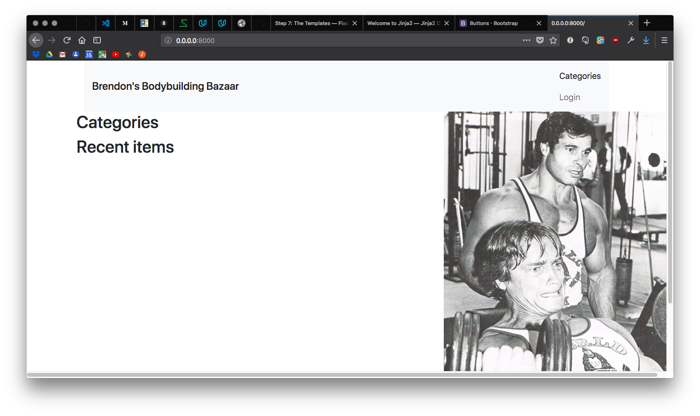

# Project methods

<a href="https://www.udacity.com/">
    
</a>

**Udacity Full Stack Web Developer Nanodegree program**

Part 03. Backend

[Project 02. Flask Item Catalog App](https://github.com/br3ndonland/udacity-fsnd03-p02-flask-catalog)

Brendon Smith

br3ndonland

## TOC
<!-- START doctoc generated TOC please keep comment here to allow auto update -->
<!-- DON'T EDIT THIS SECTION, INSTEAD RE-RUN doctoc TO UPDATE -->
**Table of Contents**  *generated with [DocToc](https://github.com/thlorenz/doctoc)*

- [Environment and documentation setup](#environment-and-documentation-setup)
- [Directory setup](#directory-setup)
- [Database setup](#database-setup)
- [Application](#application)
- [Authentication and authorization](#authentication-and-authorization)
- [Templates](#templates)
- [Style](#style)
- [Testing](#testing)

<!-- END doctoc generated TOC please keep comment here to allow auto update -->


## Environment and documentation setup
[(back to TOC)](#toc)

### Virtual machine

I already had the vagrant virtual machine environment installed and ready to go.


### Docs

* I created the basic outline of the [README](README.md).
* I read through the Udacity documentation and rubric, and added the materials to the repo in [flask-catalog-udacity-docs.md](flask-catalog-udacity-docs.md).
	- The documentation is open-ended on how to work through construction of the app.
		> Whether you start on the front end or the back end is up to you. Some people prefer seeing the layout before thinking about the data they want to present, whereas others enjoy thinking about the structure and organization of their data and the Flask application before beginning on the front end portion of their project.
	- Instructor Lorenzo Brown seems to prefer a back-end-first approach:
		> Personally, I usually start with the database layout so that the database is modelling the information the way I want. Then I go ahead and add the backend, the Flask code, the Python code, and then I move on to the frontend where I then receive feedback on the frontend where I use the feedback to make it more stylish and elegant and presentable with everything else already in place. This is just me though, it varies from developer to developer.
		
		Not that helpful, or even grammatical.
	- Lorenzo's lesson on agile iterative development (Full Stack Foundations Lesson 4, FSND Part 03 Lesson 09) actually walks through a front-end-first approach, starting with mockups.
* I reviewed my course notes, and walked through [my notes on the Flask lesson](https://github.com/br3ndonland/udacity-fsnd/blob/master/03-backend/06-09-foundations/fsnd03_08-flask.md), and the [Flask app code from the lesson](https://github.com/udacity/Full-Stack-Foundations) in Full-Stack-Foundations/Lesson-3/Final-Flask-Application.
* The **[Flask tutorial](http://flask.pocoo.org/docs/0.12/tutorial/)** gave me a helpful step-by-step outline of the app creation process.
* **I compared the steps from the Udacity lesson and the Flask tutorial to make my own app.**


## Directory setup
[(back to TOC)](#toc)

* I created a directory at */vagrant/flask-catalog* for the application, and set up the basic structure of the app directory.
* The **[Flask docs](http://flask.pocoo.org/docs/0.12/)** had some helpful instructions in the foreword for how to organize the directory:
	> [Configuration and Conventions](http://flask.pocoo.org/docs/0.12/foreword/#configuration-and-conventions)
	> 
	> Flask has many configuration values, with sensible defaults, and a few conventions when getting started. By convention, templates and static files are stored in subdirectories within the application’s Python source tree, with the names templates and static respectively. While this can be changed, you usually don’t have to, especially when getting started.
* I also referred to the **[Flask tutorial](http://flask.pocoo.org/docs/0.12/tutorial/)**:
	> [Step 0: Creating The Folders](http://flask.pocoo.org/docs/0.12/tutorial/folders/)
	> 
	> Before getting started, you will need to create the folders needed for this application:
	> ```
	> /flaskr
	>   /flaskr
	>     /static
	>     /templates
	> ```
	**I elected not to create two top-level folders.**
* I created [application.py](application.py) for the main Flask application.
* I added the */static* directory for CSS and JavaScript.
* I added the */templates* directory for the HTML webpages.


## Database setup
[(back to TOC)](#toc)

### database_setup.py

#### SQLAlchemy imports

As we did in lesson 6, I will perform CRUD operations with SQLAlchemy on an SQLite database. The SQL database is established within [database_setup.py](database_setup.py). I also read through the SQLite instructions in the [Flask tutorial](http://flask.pocoo.org/docs/0.12/tutorial/schema/), but I may not need the schema.sql file.

We first import the necessary modules:

```python
# Import SQLAlchemy modules for database
from sqlalchemy import create_engine
from sqlalchemy.orm import sessionmaker
from database_setup import Base, Category, CatalogItem, User
```


#### Classes

Next, I needed to create Python classes for the different tables in the database. We need a database of items in different categories for this project. This is similar to having restaurants with different menu items in the Udacity lesson. I was therefore able to easily adapt the `class Restaurant(Base)` to `class Category(Base)`, and `class MenuItem(Base)` to class `CatalogItem(Base)`. I added a `class User(Base)` to keep track of users registered for the app.


#### SQLAlchemy engine

Next, we need to [configure the SQLAlchemy engine](http://docs.sqlalchemy.org/en/latest/core/engines.html):

```python
engine = create_engine('sqlite:///restaurantmenu.db')
```

The [SQLAlchemy SQLite](http://docs.sqlalchemy.org/en/latest/core/engines.html#sqlite) URL has three slashes for a relative file path.

Finally, we use SQLAlchemy to create the SQLite database:

```python
Base.metadata.create_all(engine)
```

Git commit at this point: Set up database 7844cbb


### catalog.py

#### Setup

Now that I have database_setup.py to set up my database, I need to populate the database with items for the catalog. I based [catalog.py](catalog.py) on [lotsofmenus.py](https://github.com/udacity/Full-Stack-Foundations/blob/master/Lesson-4/Final-Project/lotsofmenus.py) from the Full Stack Foundations course.

As with database_setup.py, I started off adding in the necessary SQLAlchemy imports and configuring the SQLAlchemy engine.

Next, we need to:

> Bind the engine to the metadata of the Base class so that the declaratives can be accessed through a DBSession instance

```python
engine = create_engine('sqlite:///restaurantmenu.db')
Base.metadata.bind = engine
```

After we bind the engine to the Base class, we need to establish a database session. The comments in lotsofmenus.py explain:

> A `DBSession()` instance establishes all conversations with the database and represents a "staging zone" for all the objects loaded into the database session object. Any change made against the objects in the session won't be persisted into the database until you call `session.commit()`. If you're not happy about the changes, you can revert all of them back to the last commit by calling `session.rollback()`.


#### Categories and items

Now that catalog.py is set up, I will start adding items. I used a film noir theme for my [movie trailer site](https://github.com/br3ndonland/udacity-fsnd01-p01-movies), so here I will bring in another one of my interests: Bodybuilding! Welcome to Brendon's Bodybuilding Bazaar! I entered some brief info about some of my favorite strength training equipment and accessories.

I knew from experience that Python concatenates adjacent strings, so I broke the descriptions into multiple strings, with one string per line.

I included website and image URLs, and commented them out, in case I want to use them in the future.

Git commit at this point: Create item catalog 0dd29ab


### Database creation

When I first tried to create the database by running

```bash
$ python3 database_setup.py
```

I was getting errors because of the `datetime` code.

```
Traceback (most recent call last):
  File "database_setup.py", line 45, in <module>
    class Item(Base):
  File "database_setup.py", line 54, in Item
    date_created = Column(datetime, default=datetime.datetime.now())
  File "/usr/local/lib/python3.5/dist-packages/sqlalchemy/sql/schema.py", line 1279, in __init__
    self._init_items(*args)
  File "/usr/local/lib/python3.5/dist-packages/sqlalchemy/sql/schema.py", line 90, in _init_items
    item._set_parent_with_dispatch(self)
AttributeError: module 'datetime' has no attribute '_set_parent_with_dispatch'
```

I included a `date_created` object for each of the items, so the most recent items can be shown on the homepage.

I moved to the command line to troubleshoot this. My first progress came when changing `import datetime` to `from datetime import datetime`. Confusing nomenclature.

```
>>> from datetime import datetime
>>> print(datetime.now())
2018-03-22 22:12:03.950458
```

Now I need to adjust the timezone to local time. It looks like Python doesn't have built-in support for time zones.

I put this code back into database_setup.py, but was still getting the same error.

I realized that I should probably use SQLAlchemy to calculate the time.

I changed the code for SQLAlchemy:

```python
date_created = Column(datetime(timezone=True), default=func.now())
```

Which then threw another error:

```
vagrant@vagrant:/vagrant/flask-catalog$ python3 database_setup.py
Traceback (most recent call last):
  File "database_setup.py", line 45, in <module>
    class Item(Base):
  File "database_setup.py", line 54, in Item
    date_created = Column(datetime(timezone=True), default=func.now())
TypeError: Required argument 'year' (pos 1) not found
```

I tried it several more times, and finally got it to work. **The solution was to have two datetime imports, from Python and Flask.** Confusing.

Here are the imports I needed in database_setup.py for the datetime to work:

```python
from sqlalchemy import Column, ForeignKey, Integer, String, DateTime
from sqlalchemy.ext.declarative import declarative_base
from sqlalchemy.orm import relationship
from sqlalchemy import create_engine
import datetime
```

Here is the code I needed to timestamp item creation:

```python
class Item(Base):
    """Create a database table for items."""
    __tablename__ = 'items'

    id = Column(Integer, primary_key=True)
    name = Column(String(80), nullable=False)
    description = Column(String(250))
    category_id = Column(Integer, ForeignKey('category.id'))
    category = relationship(Category)
    date_created = Column(DateTime, default=datetime.datetime.now())
    user_id = Column(Integer, ForeignKey('user.id'))
    user = relationship(User)

    @property
    def serialize(self):
        """Return object data in easily serializable format"""
        return {
            'name': self.name,
            'description': self.description,
            'category': self.category.name,
            'date created': self.date_created,
            'id': self.id
        }


```

Git commit at this point: Debug database item timestamping 695e7bb


### Database population

I populated the database with items from catalog.py by running:

```
vagrant@vagrant:/vagrant/flask-catalog$ python3 catalog.py
Category: Equipment
Category: Accessories
```

I verified the additions to the database using [DB Browser for SQLite](http://sqlitebrowser.org/):

```
$ brew cask install db-browser-for-sqlite
```


## Application
[(back to TOC)](#toc)

Now that I have the database and catalog set up, it's time to code the main application in [application.py](application.py). If you're still following along in the [Flask tutorial](http://flask.pocoo.org/docs/0.12/tutorial/), this would roughly be around [Step 6: The view functions](http://flask.pocoo.org/docs/0.12/tutorial/views/).


### application.py

#### Setup

* I started with the usual imports and database connection.
* Before any operations are performed, we must first import the necessary libraries, connect to the database, and create a session to interface with the database. SQLAlchemy uses "sessions" to connect to the database. We can store the commands we plan to use, but not send them to the database until we run a commit.


#### App routes

* **The lessons didn't adequately prepare me for building the rest of the application code.** I started, as before, by reviewing code from the Full Stack Foundations restaurant menus example. I referenced [finalproject.py](https://github.com/udacity/Full-Stack-Foundations/blob/master/Lesson-4/Final-Project/finalproject.py).
* **I decided to start by defining functions for the Flask app routes, and then to leave the authentication flow for later.**


##### CRUD: Read

* The homepage app route was fairly straightforward. The most difficult thing was figuring out how to display recent items. I accomplished this by creating a `recent_items` object and using a [SQLAlchemy command](https://stackoverflow.com/questions/4186062/sqlalchemy-order-by-descending#4187279):
	```python
	    recent_items = (session.query(Item)
        .order_by(Item.date_created.desc())
        .limit(10)
        .all())
	```
* Next, I coded the app route function to display all items in a specific category. The URL in [finalproject.py](https://github.com/udacity/Full-Stack-Foundations/blob/master/Lesson-4/Final-Project/finalproject.py) is coded using the category `id`, which is okay, but it may be more intuitive to use the category name in the URL.
<!-- TODO: Re-code URL with category name -->


##### CRUD: Create an item with a POST request

* The next function to build in would be item creation. We will use POST requests for this.
* Users need to be logged in to edit items. I added a simple login verification for the local permission system:
	```python
	# Verify user is logged in
	if 'username' not in login_session:
	    return redirect('/login')
	```
	- This was based on Lesson 12. Local permission system 12.06. Quiz: Protect Menu Pages (Lesson 3 in free course [Authentication & Authorization: OAuth](https://www.udacity.com/course/authentication-authorization-oauth--ud330))
	- I will build in additional login functions later.
* Next, I needed flash messages to warn users if they haven't added all the information needed for a new item. I used the Flask lesson from Full Stack Foundations, Part 15, as a starting point (see [lesson notes](https://github.com/br3ndonland/udacity-fsnd/blob/master/04-web-apps/06-09-foundations/fsnd03_08-flask.md#message-flashing) and [lesson code](https://github.com/br3ndonland/Full-Stack-Foundations/blob/master/Lesson-3/17_Flash-Messaging-Solution/project.py))
* I added in the `from Flask import flash` to support flash messaging.
* I then added an object to provide all the proper fields for the item, based on database_setup.py.


##### CRUD: Edit and delete items

* Of course, after we create items, we may want to edit or delete them.
* We only want the creator of the item to be able to modify it.


##### JSON

I created additional app routes with `jsonify` by appending '/json' to the homepage, category, and item pages.

For example:

```python
@app.route('/catalog/<int:category_id>/json`')
@app.route('/catalog/<int:category_id>/items/json')
def show_category_json(category_id):
    """App route function to provide category data in JSON format."""
    items = session.query(Item).filter_by(category_id=category_id).all()
    return jsonify(items=[items.serialize for item in items])
```


### Next steps

Git commit at this point: Create app routes 0bcddf7 

**I thought about how to proceed. I could have built the HTML templates and tested the app, but decided to proceed with authentication and build the front-end later.**


## Authentication and authorization
[(back to TOC)](#toc)

### Getting started

I followed the [OAuth lessons](https://www.udacity.com/course/authentication-authorization-oauth--ud330) to implement sign-in. The Udacity materials are, of course, poorly formatted and outdated, and didn't prepare me for the project. The course code exists, confusingly, in two repos: [OAuth2.0](https://github.com/udacity/OAuth2.0) and [ud330](https://github.com/udacity/ud330/blob/master/Lesson2/step2/project.py). The code in ud330 is formatted a little better than the OAuth repo. 

I turned to [my notes](https://github.com/br3ndonland/udacity-fsnd/blob/master/04-web-apps/10-13-oauth/fsnd03_10-13-oauth.md) and re-watched the OAuth lessons to implement Google and Facebook sign-in.


### Google

#### Create client ID and secret

* **The client ID and secret allow the app to communicate with Google.**
* I searched around a bit and found the [Google API Client Library for Python](https://developers.google.com/api-client-library/python/).
* Created a new project in the [Google APIs Dashboard](https://console.developers.google.com/apis/dashboard) (udacity-flask-catalog).
* It seems like I will need an OAuth key, rather than a simple API key like I used in the API lessons. See [Lesson 11.05](https://github.com/br3ndonland/udacity-fsnd/blob/master/04-web-apps/10-13-oauth/fsnd03_10-13-oauth.md#1105-quiz-step-1-create-client-id--secret).
* I set the "Authorized JavaScript Origins" to allow http://localhost:8000
* Downloaded JSON and renamed to client_secrets.json
* Create a server-side helper function to store the client secret as an object
	```python
	CLIENT_ID = json.loads(open('client_secrets.json', 'r')
	    .read())['web']['client_id']
	```


#### Create anti-forgery state token

* **The anti-forgery state token is a random string generated by Flask. This helps verify the authenticated user and prevent attacks.**
* I imported Flask's version of sessions, and named it `login_session`:
	```python
	from flask import session as login_session
	import random
	import string
	```
	- `login_session` is a dictionary. We can store values there during the session.
* I then created the login page app route, including generation of a random string:
	```python
	@app.route('/login')
	def login():
	    """App route function to log in and generate token."""
	    state = ''.join(random.choice(string.ascii_uppercase + string.digits)
	                    for x in range(32))
	    login_session['state'] = state
	    return render_template('login.html', STATE=state)
	```
	- Session works like a dictionary and can store values.
	- `random` and `string` are used to generate a random string, stored in an object with the name `state` here.
	- The `xrange` in Python 2 is replaced by `range` in Python 3.
	- The `state` token is stored in the `login_session` object.
	- Passing the state token as an argument in login.html helps protect against CSRF. See [CSRF protection in Flask](http://flask.pocoo.org/snippets/3/) for more info.


#### GConnect

New imports in application.py:

```python
# Import OAuth modules for user authentication
from oauth2client.client import flow_from_clientsecrets, FlowExchangeError
from flask import make_response
import json
import requests
```

I then created the GConnect and GDisconnect app routes.

Git commit at this point: Add Google login 4d3d016


### Facebook

We were only required to implement one third-party login. Facebook login would probably be more effectively implemented with JavaScript, so I opted not to include it. See the [Facebook login documentation](https://developers.facebook.com/docs/facebook-login).


## Templates
[(back to TOC)](#toc)

* We use [Jinja](http://jinja.pocoo.org/docs/2.10/) templating in Flask. See the [Flask tutorial step 7](http://flask.pocoo.org/docs/0.12/tutorial/templates/).
* I followed the [guidelines for template inheritance](http://flask.pocoo.org/docs/0.12/patterns/templateinheritance/) by naming the base template layout.html. As we saw in the Udacity Flask lesson part 10:
	```
	
	{{ printed output code }}
	```
* HTML templates don't get to use Python indendation and spacing, so we have to inclde instructions to terminate loops:
	```
	
	
	```
* I started by quickly creating the files I knew I needed on the command line:
	```bash
	touch layout.html categories.html category.html item.html add_item.html edit_item.html delete_item.html login.html
	```
* layout.html
	- This is the base template.
	- I elected not to include the `<meta name="keywords" content="">` tag, because [Google does not use the keywords meta tag in web ranking](https://webmasters.googleblog.com/2009/09/google-does-not-use-keywords-meta-tag.html).
* login.html
	- I extended the base template.
	- I based the Google sign-in part of the template on [ud330/Lesson2/step3/templates/login.html](https://github.com/udacity/ud330/blob/master/Lesson2/step3/templates/login.html).
* asdf

## Style
[(back to TOC)](#toc)

### HTML and CSS

I imported [Bootstrap](https://getbootstrap.com/) 4.0.0 for styling. I used Bootstrap for my [portfolio website](https://br3ndonland.github.io/udacity/). It is complicated, but widely used, so I decided to use it again here. I also looked at some other minimalist frameworks like Milligram.


## Testing
[(back to TOC)](#toc)

* Here's what the app looked like when I started it up for the first time:
	
	

* :face_palm: 🤦
* Clicking Categories just stays at the same page.
* Clicking login returns an error:
	```text
	builtins.RuntimeError
	
	RuntimeError: The session is unavailable because no secret key was set.
	Set the secret_key on the application to something unique and secret.
	```
* The easiest place to start is with fixing the HTML. I need to keep the main container in line with the header.

[(back to TOC)](#toc)