# Computational narrative

<a href="https://www.udacity.com/">
    
</a>

Udacity Full Stack Web Developer Nanodegree program

[Project 4. Flask Item Catalog App](https://github.com/br3ndonland/udacity-fsnd-p4-flask-catalog)

Brendon Smith

br3ndonland

Python Flask CRUD web app with SQLite DB, Google Sign-In, and JSON API

## Table of Contents <!-- omit in toc -->

- [Environment and documentation setup](#environment-and-documentation-setup)
  - [Virtual machine](#virtual-machine)
  - [Info](#info)
- [Directory setup](#directory-setup)
- [Database setup](#database-setup)
  - [database_setup.py](#database_setuppy)
  - [database_data.py](#database_datapy)
  - [Database creation](#database-creation)
  - [Database population](#database-population)
- [Application](#application)
  - [application.py](#applicationpy)
  - [Next steps](#next-steps)
- [Authentication and authorization](#authentication-and-authorization)
  - [Getting started](#getting-started)
  - [Google](#google)
  - [Facebook](#facebook)
- [Templates](#templates)
- [Style](#style)
  - [HTML and CSS](#html-and-css)
- [First look facepalm](#first-look-facepalm)
- [Debugging app views](#debugging-app-views)
  - [Debugging pages](#debugging-pages)
  - [Debugging JSON](#debugging-json)
  - [Debugging authentication](#debugging-authentication)
  - [Debugging the login session](#debugging-the-login-session)
- [Debugging CRUD functions](#debugging-crud-functions)
  - [Add categories](#add-categories)
  - [Edit and delete categories](#edit-and-delete-categories)
  - [Add items](#add-items)
  - [Edit and delete items](#edit-and-delete-items)
  - [Revisiting database population](#revisiting-database-population)
- [Comments](#comments)
- [Review](#review)
- [Post-review](#post-review)
  - [Virtual environment](#virtual-environment)
  - [Docker container](#docker-container)

## Environment and documentation setup

### Virtual machine

I already had the vagrant virtual machine environment installed and ready to go.

### Info

- I created the basic outline of the [README](README.md).
- I read through the Udacity documentation and rubric, and added the materials to the repo in [flask-catalog-udacity-docs.md](flask-catalog-udacity-docs.md).
  - The documentation is open-ended on how to work through construction of the app.
    > Whether you start on the front end or the back end is up to you. Some people prefer seeing the layout before thinking about the data they want to present, whereas others enjoy thinking about the structure and organization of their data and the Flask application before beginning on the front end portion of their project.
  - Instructor Lorenzo Brown seems to prefer a back-end-first approach:
    > Personally, I usually start with the database layout so that the database is modelling the information the way I want. Then I go ahead and add the backend, the Flask code, the Python code, and then I move on to the frontend where I then receive feedback on the frontend where I use the feedback to make it more stylish and elegant and presentable with everything else already in place. This is just me though, it varies from developer to developer.

    Not that helpful, or even grammatical.
  - Lorenzo's lesson on agile iterative development (Full Stack Foundations Lesson 4, FSND Part 03 Lesson 09) actually walks through a front-end-first approach, starting with mockups.
- I reviewed my course notes, and walked through [my notes on the Flask lesson](https://github.com/br3ndonland/udacity-fsnd/blob/master/03-backend/06-09-foundations/fsnd03_08-flask.md), and the [Flask app code from the lesson](https://github.com/udacity/Full-Stack-Foundations) in Full-Stack-Foundations/Lesson-3/Final-Flask-Application.
- The **[Flask tutorial](http://flask.pocoo.org/docs/0.12/tutorial/)** gave me a helpful step-by-step outline of the app creation process.
- **I compared the steps from the Udacity lesson and the Flask tutorial to make my own app.**

[(Back to top)](#top)

## Directory setup

- I created a directory at */vagrant/flask-catalog- for the application, and set up the basic structure of the app directory.
- The **[Flask docs](http://flask.pocoo.org/docs/0.12/)** had some helpful instructions in the foreword for how to organize the directory:
  > [Configuration and Conventions](http://flask.pocoo.org/docs/0.12/foreword/#configuration-and-conventions)
  >
  > Flask has many configuration values, with sensible defaults, and a few conventions when getting started. By convention, templates and static files are stored in subdirectories within the application’s Python source tree, with the names templates and static respectively. While this can be changed, you usually don’t have to, especially when getting started.
- I also referred to the **[Flask tutorial](http://flask.pocoo.org/docs/0.12/tutorial/)**:
  > [Step 0: Creating The Folders](http://flask.pocoo.org/docs/0.12/tutorial/folders/)
  >
  > Before getting started, you will need to create the folders needed for this application:
  >
  > ```text
  > /flaskr
  >   /flaskr
  >     /static
  >     /templates
  > ```
  >
  **I elected not to create two top-level folders.**
- I created [application.py](application.py) for the main Flask application.
- I added the */static- directory for CSS and JavaScript.
- I added the */templates- directory for the HTML webpages.

[(Back to top)](#top)

## Database setup

### database_setup.py

#### SQLAlchemy imports

As we did in lesson 6, I will perform CRUD operations with SQLAlchemy on an SQLite database. The SQL database is established within [database_setup.py](database_setup.py). I checked out the [SQLAlchemy Query API docs](http://docs.sqlalchemy.org/en/latest/orm/query.html) and the [Object Relational Tutorial](http://docs.sqlalchemy.org/en/latest/orm/tutorial.html). I also read through the SQLite instructions in the [Flask tutorial](http://flask.pocoo.org/docs/0.12/tutorial/schema/), but I may not need the schema.sql file.

We first import the necessary modules:

```python
# Import SQLAlchemy modules for database
from sqlalchemy import create_engine
from sqlalchemy.orm import sessionmaker
from database_setup import Base, Category, CatalogItem, User
```

#### Classes

Next, I needed to create Python classes for the different tables in the database. We need a database of items in different categories for this project. This is similar to having restaurants with different menu items in the Udacity lesson. I was therefore able to easily adapt the `class Restaurant(Base)` to `class Category(Base)`, and `class MenuItem(Base)` to class `CatalogItem(Base)`. I added a `class User(Base)` to keep track of users registered for the app.

#### SQLAlchemy engine

Next, we need to [configure the SQLAlchemy engine](http://docs.sqlalchemy.org/en/latest/core/engines.html):

```python
engine = create_engine('sqlite:///restaurantmenu.db')
```

The [SQLAlchemy SQLite](http://docs.sqlalchemy.org/en/latest/core/engines.html#sqlite) URL has three slashes for a relative file path.

Finally, we use SQLAlchemy to create the SQLite database:

```python
Base.metadata.create_all(engine)
```

Git commit at this point: "Set up database" 7844cbb

### database_data.py

#### Setup

Now that I have database_setup.py to set up my database, I need to populate the database with items for the catalog. I based [database_data.py](database_data.py) on [lotsofmenus.py](https://github.com/udacity/Full-Stack-Foundations/blob/master/Lesson-4/Final-Project/lotsofmenus.py) from the Full Stack Foundations course.

As with database_setup.py, I started off adding in the necessary SQLAlchemy imports and configuring the SQLAlchemy engine.

Next, we need to:

> Bind the engine to the metadata of the Base class so that the declaratives can be accessed through a DBSession instance

```python
engine = create_engine('sqlite:///restaurantmenu.db')
Base.metadata.bind = engine
```

After we bind the engine to the Base class, we need to establish a database session. The comments in lotsofmenus.py explain:

> A `DBSession()` instance establishes all conversations with the database and represents a "staging zone" for all the objects loaded into the database session object. Any change made against the objects in the session won't be persisted into the database until you call `session.commit()`. If you're not happy about the changes, you can revert all of them back to the last commit by calling `session.rollback()`.

#### Categories and items

Now that database_data.py is set up, I will start adding items. I used a film noir theme for my [movie trailer site](https://github.com/br3ndonland/udacity-fsnd01-p01-movies), so here I will bring in another one of my interests: Bodybuilding! Welcome to Brendon's Bodybuilding Bazaar! I entered some brief info about some of my favorite strength training equipment and accessories.

I knew from experience that Python concatenates adjacent strings, so I broke the descriptions into multiple strings, with one string per line.

I included website and image URLs, and commented them out, in case I want to use them in the future.

Git commit at this point: "Create item catalog" 0dd29ab

### Database creation

When I first tried to create the database by running

```shell
$ python3 database_setup.py
```

I was getting errors because of the `datetime` code.

```text
Traceback (most recent call last):
  File "database_setup.py", line 45, in <module>
    class Item(Base):
  File "database_setup.py", line 54, in Item
    date_created = Column(datetime, default=datetime.datetime.now())
  File "/usr/local/lib/python3.5/dist-packages/sqlalchemy/sql/schema.py", line 1279, in __init__
    self._init_items(*args)
  File "/usr/local/lib/python3.5/dist-packages/sqlalchemy/sql/schema.py", line 90, in _init_items
    item._set_parent_with_dispatch(self)
AttributeError: module 'datetime' has no attribute '_set_parent_with_dispatch'
```

I included a `date_created` object for each of the items, so the most recent items can be shown on the homepage.

I moved to the command line to troubleshoot this. My first progress came when changing `import datetime` to `from datetime import datetime`. Confusing nomenclature.

```text
>>> from datetime import datetime
>>> print(datetime.now())
2018-03-22 22:12:03.950458
```

Now I need to adjust the timezone to local time. It looks like Python doesn't have built-in support for time zones.

I put this code back into database_setup.py, but was still getting the same error.

I realized that I should probably use SQLAlchemy to calculate the time.

I changed the code for SQLAlchemy:

```python
date_created = Column(datetime(timezone=True), default=func.now())
```

Which then threw another error:

```text
vagrant@vagrant:/vagrant/flask-catalog$ python3 database_setup.py
Traceback (most recent call last):
  File "database_setup.py", line 45, in <module>
    class Item(Base):
  File "database_setup.py", line 54, in Item
    date_created = Column(datetime(timezone=True), default=func.now())
TypeError: Required argument 'year' (pos 1) not found
```

I tried it several more times, and finally got it to work. **The solution was to have two datetime imports, from Python and Flask.** Confusing.

Here are the imports I needed in database_setup.py for the datetime to work:

```python
from sqlalchemy import Column, ForeignKey, Integer, String, DateTime
from sqlalchemy.ext.declarative import declarative_base
from sqlalchemy.orm import relationship
from sqlalchemy import create_engine
import datetime
```

Here is the code I needed to timestamp item creation:

```python
class Item(Base):
    """Create a database table for items."""
    __tablename__ = 'items'

    id = Column(Integer, primary_key=True)
    name = Column(String(80), nullable=False)
    description = Column(String(250))
    category_id = Column(Integer, ForeignKey('category.id'))
    category = relationship(Category)
    date_created = Column(DateTime, default=datetime.datetime.now())
    user_id = Column(Integer, ForeignKey('user.id'))
    user = relationship(User)

    @property
    def serialize(self):
        """Return object data in easily serializable format"""
        return {
            'name': self.name,
            'description': self.description,
            'category': self.category.name,
            'date created': self.date_created,
            'id': self.id
        }

```

Git commit at this point: "Debug database item timestamping" 695e7bb

### Database population

I populated the database with items from database_data.py by running:

```text
vagrant@vagrant:/vagrant/flask-catalog$ python3 database_data.py
Category: Equipment
Category: Accessories
```

I verified the additions to the database using [DB Browser for SQLite](http://sqlitebrowser.org/):

```text
$ brew cask install db-browser-for-sqlite
```


[(Back to top)](#top)

## Application

Now that I have the database and catalog set up, it's time to code the main application in [application.py](application.py). If you're still following along in the [Flask tutorial](http://flask.pocoo.org/docs/0.12/tutorial/), this would roughly be around [Step 6: The view functions](http://flask.pocoo.org/docs/0.12/tutorial/views/).

### application.py

#### application.py setup

- I started with the usual imports and database connection.
- Before any operations are performed, we must first import the necessary libraries, connect to the database, and create a session to interface with the database. SQLAlchemy uses "sessions" to connect to the database. We can store the commands we plan to use, but not send them to the database until we run a commit.

#### App routes

- **The lessons didn't adequately prepare me for building the rest of the application code.** I started, as before, by reviewing code from the Full Stack Foundations restaurant menus example. I referenced [finalproject.py](https://github.com/udacity/Full-Stack-Foundations/blob/master/Lesson-4/Final-Project/finalproject.py).
- **I decided to start by defining functions for the Flask app routes, and then to leave the authentication flow for later.**

##### CRUD: Read

- The homepage app route was fairly straightforward. The most difficult thing was figuring out how to display recent items. I accomplished this by creating a `recent_items` object and using a [SQLAlchemy command](https://stackoverflow.com/questions/4186062/sqlalchemy-order-by-descending#4187279):

  ```python
      recent_items = (session.query(Item)
        .order_by(Item.date_created.desc())
        .limit(10)
        .all())
  ```

- Next, I coded the app route function to display all items in a specific category. The URL in [finalproject.py](https://github.com/udacity/Full-Stack-Foundations/blob/master/Lesson-4/Final-Project/finalproject.py) is coded using the category `id`, which is okay, but it may be more intuitive to use the category name in the URL.

##### CRUD: Create an item with a POST request

- The next function to build in would be item creation. We will use POST requests for this.
- Users need to be logged in to edit items. I added a simple login verification for the local permission system:

  ```python
  # Verify user is logged in
  if 'username' not in login_session:
      return redirect('/login')
  ```

  - This was based on Lesson 12. Local permission system 12.06. Quiz: Protect Menu Pages (Lesson 3 in free course [Authentication & Authorization: OAuth](https://www.udacity.com/course/authentication-authorization-oauth--ud330))
  - I will build in additional login functions later.
- Next, I needed flash messages to warn users if they haven't added all the information needed for a new item. I used the Flask lesson from Full Stack Foundations, Part 15, as a starting point (see [lesson notes](https://github.com/br3ndonland/udacity-fsnd/blob/master/04-web-apps/06-09-foundations/fsnd03_08-flask.md#message-flashing) and [lesson code](https://github.com/br3ndonland/Full-Stack-Foundations/blob/master/Lesson-3/17_Flash-Messaging-Solution/project.py))
- I added in the `from Flask import flash` to support flash messaging.
- I then added an object to provide all the proper fields for the item, based on database_setup.py.

##### CRUD: Edit and delete items

- Of course, after we create items, we may want to edit or delete them.
- We only want the creator of the item to be able to modify it.

##### JSON

I created additional app routes with `jsonify` by appending '/json' to the homepage, category, and item pages.

For example:

```python
@app.route('/catalog/<int:category_id>/json`')
@app.route('/catalog/<int:category_id>/items/json')
def show_category_json(category_id):
    """App route function to provide category data in JSON format."""
    items = session.query(Item).filter_by(category_id=category_id).all()
    return jsonify(items=[items.serialize for item in items])
```

### Next steps

Git commit at this point: "Create app routes" 0bcddf7

**I thought about how to proceed. I could have built the HTML templates and tested the app, but decided to proceed with authentication and build the front-end later.**

[(Back to top)](#top)

## Authentication and authorization

### Getting started

- I followed the [OAuth lessons](https://www.udacity.com/course/authentication-authorization-oauth--ud330) to implement sign-in.
- The Udacity materials are, of course, poorly formatted and outdated, and didn't prepare me for the project.
- The course code exists, confusingly, in two repos: [OAuth2.0](https://github.com/udacity/OAuth2.0) and [ud330](https://github.com/udacity/ud330/blob/master/Lesson2/step2/project.py). The code in ud330 is formatted a little better than the OAuth repo.
- The vagrant virtual machine includes `oauth2client` for authentication, but [`oauth2client` has been deprecated](https://google-auth.readthedocs.io/en/latest/oauth2client-deprecation.html). Yet another outdated piece of code from Udacity.
- Armin Ronacher's [Flask-OAuth](https://github.com/mitsuhiko/flask-oauth) is no longer maintained. He points users to [Flask-Dance](https://github.com/singingwolfboy/flask-dance), which is at an early stage of development. [Flask-OAuthlib](https://flask-oauthlib.readthedocs.io/en/latest/) was another replacement for Flask-OAuth, but is "not maintained well" either.
- There is a newer authentication module, [`authlib`](https://docs.authlib.org/en/latest/#), with instructions for Flask. This seems like the way to go.
- Google offers [`google-auth`](https://google-auth.readthedocs.io/en/latest/index.html) as a replacement. Google's documentation is confusing and not thorough. They mix instructions for the old and new modules together without clearly explaining which is being referenced.
- I decided to stick with `oauth2client` for consistency with the virtual machine.

### Google

#### Create client ID and secret

- **The client ID and secret allow the app to communicate with Google.**
- I searched around a bit and found the [Google API Client Library for Python](https://developers.google.com/api-client-library/python/).
- Created a new project in the [Google APIs Dashboard](https://console.developers.google.com/apis/dashboard) (udacity-flask-catalog).
- It seems like I will need an OAuth key, rather than a simple API key like I used in the API lessons. See [Lesson 11.05](https://github.com/br3ndonland/udacity-fsnd/blob/master/04-web-apps/10-13-oauth/fsnd03_10-13-oauth.md#1105-quiz-step-1-create-client-id--secret).
- Set the "Authorized JavaScript Origins" to allow [localhost:8000](http://localhost:8000).
- Downloaded JSON and renamed to client_secrets.json
- Created a server-side helper function to store the client secret as an object

  ```python
  CLIENT_ID = json.loads(open('client_secrets.json', 'r')
      .read())['web']['client_id']
  ```

#### Create anti-forgery state token

- **The anti-forgery state token is a random string generated by Flask. This helps verify the authenticated user and prevent attacks.**
- I imported Flask's version of sessions, and named it `login_session`:

  ```python
  from flask import session as login_session
  import random
  import string
  ```

  - `login_session` is a dictionary. We can store values there during the session.
- I then created the login page app route, including generation of a random string:

  ```python
  @app.route('/login')
  def login():
      """App route function to log in and generate token."""
      state = ''.join(random.choice(string.ascii_uppercase + string.digits)
                      for x in range(32))
      login_session['state'] = state
      return render_template('login.html', STATE=state)
  ```

  - Session works like a dictionary and can store values.
  - `random` and `string` are used to generate a random string, stored in an object with the name `state` here.
  - The `xrange` in Python 2 is replaced by `range` in Python 3.
  - The `state` token is stored in the `login_session` object.
  - Passing the state token as an argument in login.html helps protect against CSRF. See [CSRF protection in Flask](http://flask.pocoo.org/snippets/3/) for more info.

#### GConnect

New imports in application.py:

```python
# Import OAuth modules for user authentication
from oauth2client.client import flow_from_clientsecrets, FlowExchangeError
from flask import make_response
import json
import requests
```

I then created the GConnect and GDisconnect app routes.

Git commit at this point: "Add Google login" 4d3d016

### Facebook

We were only required to implement one third-party login. Facebook login would probably be more effectively implemented with JavaScript, so I opted not to include it. See the [Facebook login documentation](https://developers.facebook.com/docs/facebook-login).

[(Back to top)](#top)

## Templates

- We use [Jinja](http://jinja.pocoo.org/docs/2.10/) templating in Flask. See the [Flask tutorial step 7](http://flask.pocoo.org/docs/0.12/tutorial/templates/).
- I followed the [guidelines for template inheritance](http://flask.pocoo.org/docs/0.12/patterns/templateinheritance/) by naming the base template layout.html. As we saw in the Udacity Flask lesson part 10:

  ```text
  
  {{ printed output code }}
  ```

- HTML templates don't get to use Python indendation and spacing, so we have to include instructions to terminate loops:

  ```text
  
  
  ```

- I started by quickly creating the files I knew I needed on the command line:

  ```shell
  touch layout.html categories.html category.html item.html add_item.html edit_item.html delete_item.html login.html
  ```

- layout.html
  - This is the base template.
  - I elected not to include the `<meta name="keywords" content="">` tag, because [Google does not use the keywords meta tag in web ranking](https://webmasters.googleblog.com/2009/09/google-does-not-use-keywords-meta-tag.html).
- login.html
  - I extended the base template.
  - I based the Google sign-in part of the template on [ud330/Lesson2/step3/templates/login.html](https://github.com/udacity/ud330/blob/master/Lesson2/step3/templates/login.html).

Git commit at this point: "Create templates" 5d1febd

## Style

### HTML and CSS

I imported [Bootstrap](https://getbootstrap.com/) 4 for styling. I used Bootstrap for my [portfolio website](https://br3ndonland.github.io/udacity/). It is complicated, but widely used, so I decided to use it again here. I also looked at some other minimalist frameworks like Milligram.

[(Back to top)](#top)

## First look facepalm

- Here's what the app looked like when I started it up for the first time:

  

- Categories and items aren't listed.
- Clicking Categories just stays at the same page.
- Clicking login returns an error:

  ```text
  builtins.RuntimeError

  RuntimeError: The session is unavailable because no secret key was set.
  Set the secret_key on the application to something unique and secret.
  ```

:face_palm: 🤦

[(Back to top)](#top)

## Debugging app views

### Debugging pages

#### index.html

##### Page structure

- The easiest place to start is with fixing the HTML page layout. I need to keep the main container in line with the header. This was easily fixed by adding a container around the block content tags in *layout.html*.

  ```html
  <!-- Main page content -->
  <main>
    <div class="container">
      
      
    </div>
  </main>
  ```

- Adding a `class="img-fluid"` to the image at the right in *index.html- kept it within the container.
- Next, I added buttons to the navbar.
- The homepage is starting to look a little better now:

  

- I added a footer with a [border](https://getbootstrap.com/docs/4.0/utilities/borders/) above to *layout.html*.
- I put the category and item lists inside columns to align them.

##### Page categories and items

- Next, I need the categories and items to show up.
- **This took many hours, and I couldn't really figure out how to be systematic about the changes.**
- I eventually got it to work through tandem debugging of the app route functions in *application.py- and the Jinja tags in *index.html*.
- I browsed through the traceback, and found some issues with *index.html*:

  ```text
  File "/vagrant/flask-catalog/templates/index.html", line 1, in top-level template code

  

  File "/vagrant/flask-catalog/templates/layout.html", line 32, in top-level template code

  

  File "/vagrant/flask-catalog/templates/index.html", line 13, in block "content"

  <a href="{{ url_for('category', category=category.name) }}">
  ```

- I deleted the links and the items showed up:

  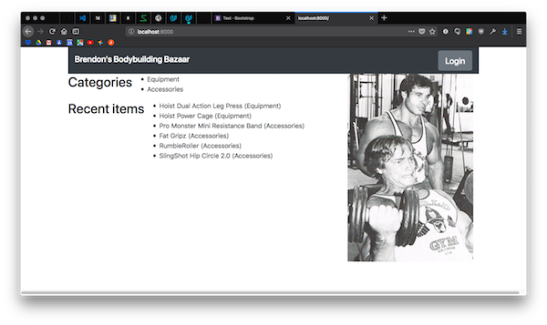

- This means I'm having an issue with `url_for` in *index.html*. The Udacity lessons should have explained this function more effectively. We touched on it in 8.11. Quiz: URL for Quiz, but the lessons were disorganized and it's difficult to keep all the app features straight. I searched the Flask documentation and found helpful info on [URL building with `url_for`](http://flask.pocoo.org/docs/0.12/quickstart/#url-building) on the quickstart page:
  > To build a URL to a specific function you can use the `url_for()` function. It accepts the name of the function as first argument and a number of keyword arguments, each corresponding to the variable part of the URL rule. Unknown variable parts are appended to the URL as query parameters.
- I deleted the recent items part so I could focus on the categories part. After going back and forth between *index.html- and the `show_category` function in *application.py*, correcting the variables referenced, I eventually got the homepage to show up:

  ```html
  
    <li>
      <a href="{{ url_for('show_category', category=category.name) }}">
      {{ category.name }}
      </a>
    </li>
  
  ```

  

- Getting the URLs for the items to show up on the homepage also depends on how the item URLs are built in *application.py*. I was successful with this encoding:

  ```python
  @app.route('/<string:category>/<string:category_item>')
  ```

- I then modified the HTML in *index.html*. In order to use the item name in the URL, I had to replace spaces with dashes, within the Jinja `url_for` template. Note that I used `%20` and `%2D`, instead of space and dash, for proper [URL encoding (percent encoding)](https://en.wikipedia.org/wiki/Percent-encoding).

  ```html
  
    <li>
      <a href="{{ url_for('show_item', category=item.category.name, category_item=item.name) | replace('%20', '%2D') }}">
      {{ item.name }} <em>({{ item.category.name }})</em>
      </a>
    </li>
  
  ```

  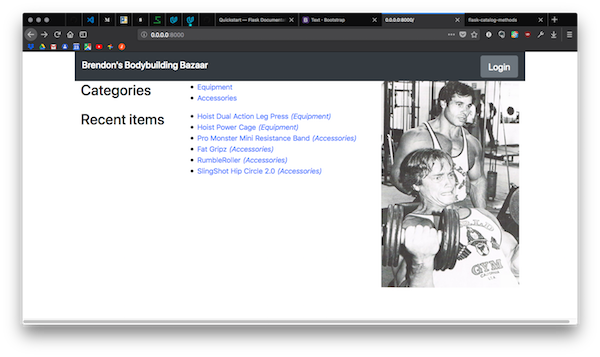

- **Alright! Looking a lot better!**

Git commit at this point: "Debug homepage" 6b21f07

#### show_category.html

- Now that I have the homepage at *index.html- looking good, I need to debug the category and item pages so they show up.
- Again, this required tandem debugging of the app route functions in *application.py- and the Jinja tags in *show_category.html*.
- I was having issues accessing the data with SQLAlchemy. Breaking the queries onto different lines helped keep them straight. The solution was to query the categories by name, but the items by category ID. Confusing.

  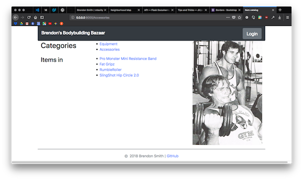

- The scrollbar at the bottom was there because I hadn't enclosed the message flashing HTML in a container.
- `Items in {{ category }}` wasn't displaying the category name at first. The solution was to go back to the `show_category` code in *application.py- and change `render_template`. This function passes variables that can be used in the template. I originally had `category_name=category`, which returns `<database_setup.Category object at 0xb57f44ec>`.

  ```python
  # Render webpage
    return render_template('show_category.html',
                           categories=categories,
                           category_name=category,
                           category_items=category_items,
                           category_items_count=category_items_count)
  ```

- I changed it to `category_name=category.name`, which provided the name of the currently selected category.

  ```python
  # Render webpage
    return render_template('show_category.html',
                           categories=categories,
                           category_name=category.name,
                           category_items=category_items,
                           category_items_count=category_items_count)
  ```

- I used the `category_items_count` variable to provide an item count on the page with `{{ category_items_count }} items`.
- I also modified the SQLAlchemy command to sort the items alphabetically.

  ```python
    category_items = (session.query(Item)
                      .filter_by(category_id=category.id)
                      .order_by(Item.name)
                      .all())
  ```

  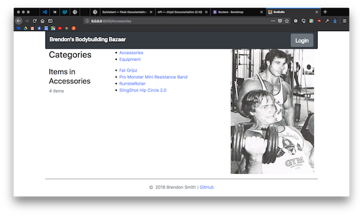

- **Excellent!**

#### show_item.html

- Now I need to do the same thing for the item page. I did tandem troubleshooting of the `show_item` app route and *show_item.html*.
- I had some issues with the SQLAlchemy query to retrieve the individual item from the database. I was basically just not getting the information. I played around with the SQLAlchemy queries for a while. I still don't understand the syntax well.
- I was only able to get the RumbleRoller item page to come up:

  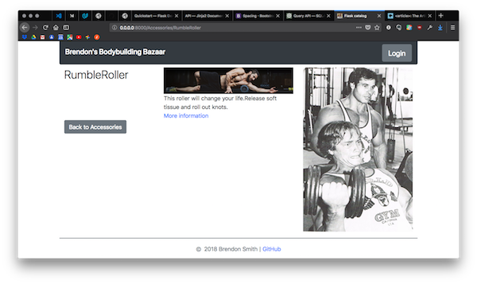

- This told me that there was probably an issue with spacing in the item names. Remember that I added [URL encoded](https://en.wikipedia.org/wiki/Percent-encoding) dashes (`%2D`) to the URLs.
- After some trial and error, I was able to formulate a coherent SQLAlchemy query. I attempted to change out the dashes for spaces, so the item name would match the database entry.

  ```python
  item = (session.query(Item)
          .filter_by(name=item.replace('%2D', '%2F'), category_id=category.id)
          .one())
  ```

- This was unsuccessful. I stepped into the Flask console to investigate.

  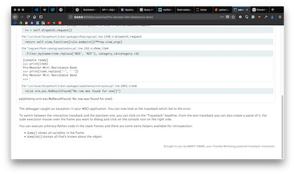

- I could see that `print(item)` returned the item name with hyphens, indicating that my string replacement was unsuccessful. **Python is reading the regular character, not the percent encoded character.** Modifying the string replacement to `item.replace('-', ' ')` successfully returned the item name.

  ```text
  >>> print(item)
  Pro-Monster-Mini-Resistance-Band
  >>> print(item.replace('-', ' '))
  Pro Monster Mini Resistance Band
  ```

  ```python
  item = (session.query(Item)
          .filter_by(name=item.replace('-', ' '), category_id=category.id)
          .one())
  ```

- **Success! I now have functioning home, category and item pages!**

  

- **The app looks great on mobile devices also**, thanks to the responsive Bootstrap framework. The screenshot below simulates an Apple iPhone 6S with Firefox Developer Tools.

  

Git commit at this point: "Debug home, category, and item pages" 84ee802

[(Back to top)](#top)

### Debugging JSON

- I revised the JSON pages in accordance with the new app route functions.
- Again, for some reason, I was able to read category data easily, but I had trouble reading item data from the database.

#### Homepage JSON

- I started with the homepage. It is easy to display just the categories:

  ```python
  @app.route('/json')
  def home_json():
      """App route function to provide catalog data in JSON format."""

      categories = (session.query(Category)
                    .all())

      return jsonify(categories=[category.serialize for category in categories])
  ```

  ```json
  {
    "categories": [
      {
        "id": 1,
        "name": "Equipment"
      },
      {
        "id": 2,
        "name": "Accessories"
      }
    ]
  }
  ```

- Adding the items in throws an error:

  ```python
  @app.route('/json')
  def home_json():
      """App route function to provide catalog data in JSON format."""

      categories = (session.query(Category)
                    .all())
      items = (session.query(Item)
               .all())

      return jsonify(categories=[category.serialize for category in categories],
                     items=[items.serialize for item in items])
  ```

  ```text
  AttributeError: 'list' object has no attribute 'serialize'
  ```

- The Flask console reveals that I am just retrieving a list of database entries. It's strange that there are only six items.

  ```text
  >>> print(items)
  [<database_setup.Item object at 0xb585d3ac>, <database_setup.Item object at 0xb585d86c>, <database_setup.Item object at 0xb585d8cc>, <database_setup.Item object at 0xb585d96c>, <database_setup.Item object at 0xb585da2c>, <database_setup.Item object at 0xb585daec>]
  ```

- **I already included serialization in the class defintions in database_setup.py. Why is this so difficult?** I still felt like the names of the classes, tables, and objects overlapped too much. I wasn't sure what I was calling where.
- **The solution was to revise the class and table names** in *database_setup.py*. It didn't make sense to have a table named 'item' with more than one item in it, anyway.

  ```text
  class User => class Users
  __tablename__ = 'user' => __tablename__ = 'users'

  class Category => class Categories
  __tablename__ = 'category' => __tablename__ = 'categories'

  class Item => class Items
  __tablename__ = 'item' => __tablename__ = 'items'

  ```

- I revised the app route to show all the items and categories. The syntax used in `jsonify()` is very confusing.

  ```python
  @app.route('/json')
  def catalog_json():
      """App route function to provide catalog data in JSON format."""

      categories = (session.query(Categories).all())
      items = (session.query(Items).all())

      return jsonify(categories=[categories.serialize for categories in categories],
                     items=[items.serialize for items in items])
  ```

- After updating all the references to class and table names in *database_data.py- and *application.py*, I closed down Flask, deleted, re-created, and re-populated the database, and started the app again.
- I browsed to [/json](http://0.0.0.0:8000/json) and got a nice JSON output!

  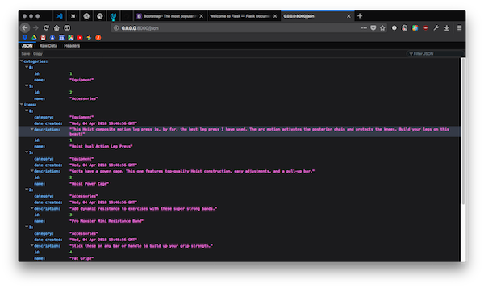

#### Categories JSON

- Unfortunately, displaying JSON for the categories still took me a few more hours.
- I had already revised the database classes and table names for the homepage JSON as described above, so I focused on revising the app route.
- I copied the `category` and `category_items` objects from the `show_category` app route.
- I then had to revise the `jsonify()` code, which was even more confusing here. After many tries, I finally figured out the magic combination (or repetition) of terms:

  ```python
  @app.route('/<string:category>/json')
  def show_category_json(category):
      """App route function to provide category data in JSON format."""

      category = (session.query(Categories)
                  .filter_by(name=category)
                  .one())
      category_items = (session.query(Items)
                        .filter_by(category_id=category.id)
                        .order_by(Items.name)
                        .all())

      return jsonify(category=[category.serialize],
                     items=([category_items
                            .serialize for category_items in category_items]))
  ```

- "category_items.serialize for category_items in category_items"? Wow.

  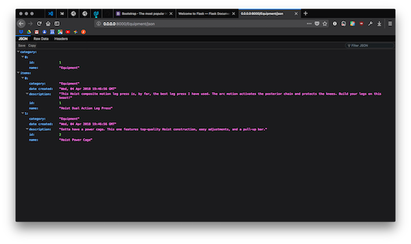

#### Individual items JSON

- This was easy after figuring out the category JSON.

  ```python
  @app.route('/<string:category>/<string:item>/json')
  def show_item_json(category, item):
      """App route function to provide item data in JSON format."""

      category = (session.query(Categories)
                  .filter_by(name=category)
                  .one())
      item = (session.query(Items)
              .filter_by(name=item.replace('-', ' '))
              .one())

      return jsonify(item=[item.serialize])
  ```

  ```json
  {
    "item": [
      {
        "category": "Equipment",
        "date created": "Wed, 04 Apr 2018 19:46:56 GMT",
        "description": "This Hoist composite motion leg press is, by far, the best leg press I have used. The arc motion activates the posterior chain and protects the knees. Build your legs on this beast!",
        "id": 1,
        "name": "Hoist Dual Action Leg Press"
      }
    ]
  }
  ```

- I updated the item pages to have a JSON link for convenience. **Looking good!**

  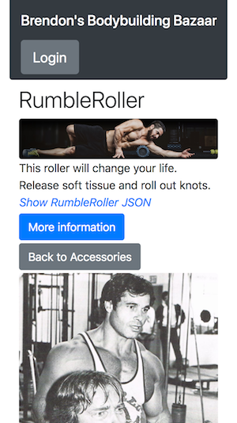

Git commit at this point: "Debug database names and JSON endpoints" ff3517e

[(Back to top)](#top)

### Debugging authentication

#### Deciding how to proceed

- Next, I need to debug the login.
- I considered switching to a non-deprecated authentication module.
- I could use [`authlib`](https://docs.authlib.org/en/latest/#).
- Google offers [`google-auth`](https://google-auth.readthedocs.io/en/latest/index.html) as a replacement.
- I asked my Udacity mentor, and he recommended either `authlib` or `google-auth`.

#### google-auth

- I will go with `google-auth`. *I think.*
- It was difficult to navigate the documentation.
- I installed `google-auth` with

  ```shell
  $ pip install --upgrade google-auth
  ```

- I obtained [user credentials](https://google-auth.readthedocs.io/en/latest/user-guide.html#user-credentials) with OAuth2.0

  ```python
  import google.oauth2.credentials
  credentials = google.oauth2.credentials.Credentials('access_token')
  ```

  - *There is also an option to [obtain credentials with service account private key files](https://google-auth.readthedocs.io/en/latest/user-guide.html#service-account-private-key-files). Is this a separate option from OAuth2.0? Or related? Unclear.*

    ```python
    from google.oauth2 import service_account
    credentials = (service_account.Credentials
                  .from_service_account_file('client_secrets.json'))
    ```

- I created a session object for [making authenticated requests](https://google-auth.readthedocs.io/en/latest/user-guide.html#making-authenticated-requests)

  ```python
  from google.auth.transport.requests import AuthorizedSession
  authed_session = AuthorizedSession(credentials)
  ```

- Add Google Sign-In to login page: Used code from the [guidelines for Google Sign-In for Websites](https://developers.google.com/identity/sign-in/web/). I [integrated Google Sign-In](https://developers.google.com/identity/sign-in/web/sign-in) with the HTML and JavaScript below. I put the `<head>` code inside *layout.html*, and the `<body>` code inside *login.html*.

  ```html
  <head>
    <meta name="google-signin-scope" content="profile email">
    <meta name="google-signin-client_id" content="YOUR_CLIENT_ID.apps.googleusercontent.com">
    <script src="https://apis.google.com/js/platform.js" async defer></script>
  </head>
  <body>
    <div class="g-signin2" data-onsuccess="onSignIn" data-theme="dark"></div>
    <script>
      function onSignIn(googleUser) {
        // Useful data for your client-side scripts:
        var profile = googleUser.getBasicProfile();
        console.log("ID: " + profile.getId()); // Don't send this directly to your server!
        console.log('Full Name: ' + profile.getName());
        console.log('Given Name: ' + profile.getGivenName());
        console.log('Family Name: ' + profile.getFamilyName());
        console.log("Image URL: " + profile.getImageUrl());
        console.log("Email: " + profile.getEmail());

        // The ID token you need to pass to your backend:
        var id_token = googleUser.getAuthResponse().id_token;
        console.log("ID Token: " + id_token);
      };
    </script>
  </body>
  ```

- The code retrieves user data and generates a token.
- What do I do about `content="YOUR_CLIENT_ID.apps.googleusercontent.com"`? Do I set that as a variable, and pass it in with Jinja? I decided to just delete it.
- [Authenticate with a backend server](https://developers.google.com/identity/sign-in/web/backend-auth) using the Google API Client Library.
- Google says:
  >Rather than writing your own code to perform these verification steps, we strongly recommend using a Google API client library for your platform, or calling our tokeninfo validation endpoint.
- Sounds good to me.
- I tried dropping the code chunks into my application, but the `google-auth` documentation wasn't clear enough. I decided to go back to the outdated `oauth2client` authentication method, because at least it works.

#### Back to oauth2client

- I decided to go back to the outdated `oauth2client` authentication method, because at least it works, and I have some examples to follow. `google-auth` was too complicated, and the documentation wasn't clear enough. If I re-did it from scratch, I would also try [`authlib`](https://docs.authlib.org/en/latest/index.html), because the documentation includes examples for Flask.
- When I click login, I now get:

  ```text
  RuntimeError: The session is unavailable because no secret key was set.
  Set the secret_key on the application to something unique and secret.

  File "/vagrant/flask-catalog/application.py", line 196, in login
    login_session['state'] = state
  ```

- I don't understand this error. I verified that I am generating a `state` variable hash in the browser console, but it looks like I'm not generating a `login_session`:

  ```text
  >>> print(state)
  L9JN9HKIOWQ9CGX1PJ37HBIJUAB8H2EW
  >>> print(login_session)
  <NullSession {}>
  ```

- I'm not sure if this is okay or not. I'm not logged in yet, so it makes sense that I wouldn't have `login_session`.
- I commented out `login_session['state'] = state`, tried again, and... I got something!

  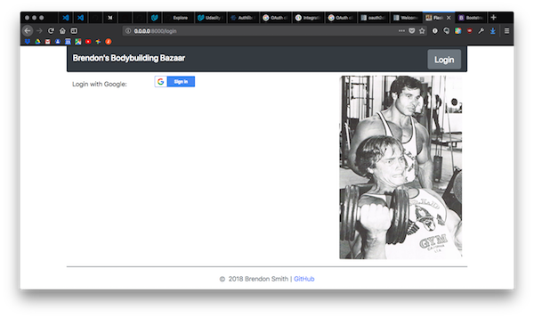

- It looks like I don't need `login_session['state'] = state`, or the secret key.
- Clicking login returns an error. At least the error is with Google now. Getting somewhere.

  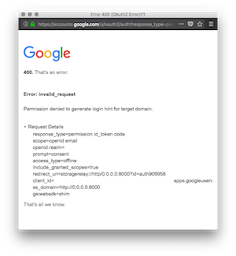

- The app didn't show up at all when I changed the host from '0.0.0.0' to 'localhost'.

  ```python
  # If this file is called as a standalone program:
  if __name__ == '__main__':
      # Run the Flask app on port 8000 and enable debugging
      app.run(host='localhost', port=8000, debug=True)
  ```

  The browser returned:

  >The connection was reset
  >
  >The connection to the server was reset while the page was loading.
  >
  >The site could be temporarily unavailable or too busy. Try again in a few moments.
  >
  >If you are unable to load any pages, check your computer’s network connection.
  >
  >If your computer or network is protected by a firewall or proxy, make sure that Firefox is permitted to access the Web.

- I eventually found that there were two issues here:
  - I needed to configure the Authorized JavaScript Origins in the Google APIs Client ID to include `http://localhost:8000`. We did go over this in the OAuth lessons.
  - [Google doesn't accept IP addresses](https://stackoverflow.com/questions/36020374/google-permission-denied-to-generate-login-hint-for-target-domain-not-on-localh#36162748). I need to change the browser URL from `http://0.0.0.0:8000/` to `http://localhost:8000/`. I looked into ways to automatically redirect, but didn't come up with much. I think the best option is just to leave the application code the same, and manually navigate to [http://localhost:8000](http://localhost:8000).
  - As you can see, if I attempt to log in from [http://0.0.0.0:8000](http://0.0.0.0:8000), Google returns an error:

    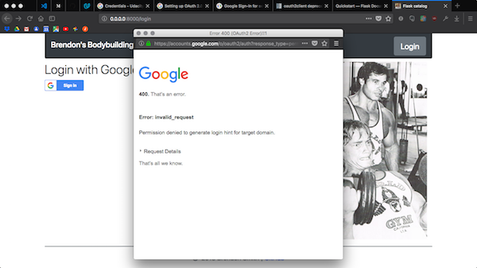

  - If I simply change the URL in the browser to [http://localhost:8000](http://localhost:8000), without changing the application code at all, Google is fine with it.

    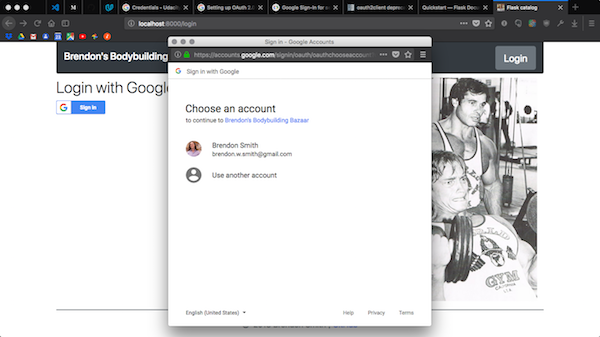

- Onto the next issue. When I click my account to continue, the Google dialog disappears, but nothing happens in the app. The console traceback shows `KeyError: 'state'`. I guess I do need `login_session['state'] = state` after all. When I add `login_session['state'] = state` back to `def create_user(login_session)`, I'm back to the error I had before.

  ```text
  RuntimeError: The session is unavailable because no secret key was set.
  Set the secret_key on the application to something unique and secret.

  File "/vagrant/flask-catalog/application.py", line 196, in login
    login_session['state'] = state
  ```

- I found that I simply had to change the order of terms, so that `app.run()` was last.

  ```python
  # If this file is called as a standalone program:
  if __name__ == '__main__':
      # Run the Flask app on port 8000 and enable debugging
      app.secret_key = 'super secret key'
      app.run(host='0.0.0.0', port=8000, debug=True)
  ```

- Now I am able to click through to the Google login again.

#### First successful login

- I tried moving the JavaScript from *login.html* to a separate file, *static/js/g-signin.js*, and modifying *login.html* to say `<script src="../static/js/g-signin.js"></script>`. It looks like it wasn't properly getting access to the template tags. I will need to keep the JS inline in the HTML. This is an annoying lack of continuity between Flask and JavaScript.

  ```text
  10.0.2.2 - - [11/Apr/2018 21:04:51] "POST /gconnect?state={{%20STATE%20}} HTTP/1.1" 401 -
  ```

- After I moved the JavaScript back inline in login.html, and clicked log in, I got this message:

  ```text
  oauth2client.clientsecrets.InvalidClientSecretsError: Missing property "redirect_uris" in a client type of "web".
  ```

- I added a redirect URI on the Google API Dashboard back to [http://localhost:8000](http://localhost:8000), and re-downloaded the client secrets file, which now contained the redirect URI.
- I also had to remove references to profile photos here.
- When I click login now, I see a message, "Welcome, Brendon Smith!" and I am redirected to the homepage at [http://localhost:8000](http://localhost:8000). **First successful login!**
- The message formatting is awkward. It is coming from this part of `def gconnect():`

  ```python
  output = ''
  output += '<h1>Welcome, '
  output += login_session['username']
  output += '!</h1>'
  output += '<img src="'
  ```

- There should be a cleaner way of displaying the welcome message. Why isn't this flashed?
- I at least adjusted it to `h3`.

  

Git commit at this point: "Debug login page" dbc4cbe

[(Back to top)](#top)

### Debugging the login session

- After login, I am registered as a user in the database. Logging in again prints a line in the terminal saying I'm registered. Good.
- There were lots of not-so-good things happening also though. *FACEPALM 2.0!!!*
  - It's not picking up the Google profile picture. I commented out the code that references the user picture.
  - After redirection, I do see some text at the bottom of the screen, but it does not persist after clicking.
  - The login button is still visible after login.
  - The buttons for adding, editing, and deleting items are not visible.
  - Although I don't see the buttons, the add item and add category pages are there.
  - Submitting information to add an item or category returns an error.
  - Attempting to visit pages for editing items and categories returns a SQL error.

    ```text
    File "/usr/local/lib/python3.5/dist-packages/flask/app.py", line 1598, in dispatch_request
    return self.view_functions[rule.endpoint](**req.view_args)
    File "/vagrant/flask-catalog/application.py", line 95, in show_category
    .filter_by(name=category)
    File "/usr/local/lib/python3.5/dist-packages/sqlalchemy/orm/query.py", line 2843, in one
    raise orm_exc.NoResultFound("No row was found for one()")
    sqlalchemy.orm.exc.NoResultFound: No row was found for one()
    ```

  - The `show_category` function and the category pages work fine.
  - I got around the SQLAlchemy error by copying the SQLAlchemy code from the `show_item()` function into the `edit_item()` function.
  - I also commented out the requirement that only the creator of the item can edit, just for testing purposes.
  - Finally got to see the edit item page!

    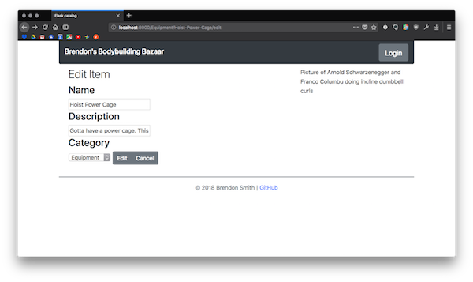

  - My pic of Arnold and Franco disappeared. I was using a relative URL to retrieve the pic. Converting to an absolute URL brought it back.
  - Git commit at this point: "Update edit item page" 875f8dc
  - Submitting the page still returns an error, like the add category and add item pages.
- Next, *FLASK, WHERE'S MY SESSION?* Why is my login state not persisting? Or is it? It might still be there, and I just need to make the flash message persist.
  - I added `print()` statements throughout the `login()` function to figure out why I was getting confused.
  - **A source of confusion was the `user_id` object I was using.** Google returns a mystical `user_id` in `login_session`, that seems to be an integer uniquely identifying the user, and that we pick up with `user_id = credentials.id_token['sub']`. I considered adding the `user_id` to the `users` table in the database, to help identify users, but decided not to, because of how difficult the `user_id` is to find. I couldn't find this integer listed or explained on the Google API Dashboard. In addition to the `user_id` in `login_session`, I was also using the name `user_id` for the database. I used it as a foreign key in the categories and items tables, to refer to the database ID (primary key) of the item creator. I changed the database column title in *database_setup.py* from `user_id` to `creator_db_id` to reduce confusion.
  - Next, I started getting another error:

    ```text
      File "/vagrant/flask-catalog/application.py", line 262, in gconnect
        print('New user {} added to database.'.format(user.email))
    AttributeError: 'NoneType' object has no attribute 'email'
    ```

  - I debugged this by changing `user.email` to `data['email']`. This makes sense. If the user isn't in the database yet, there's no `user.email` entry. The `data['email']` is what comes in directly from Google. I could also use `login_session['email']`, because the login session has been established at that point.
- Logout
  - Logging out returns a 400 bad request from Google.
  - After working on the `gconnect()` function, I was able to successfully log out by browsing to [http://localhost:8000/logout](http://localhost:8000/logout).
  - I may actually not need to worry about rejecting the access token, because it doesn't appear to be stored on my side. Google may have changed their authentication methods since the course was recorded. I wouldn't be surprised.
  - Git commit at this point: "Debug login and logout functions" b337082
    - Add print statements for debugging
    - Remove token validation
    - Distinguish user_id variables from database and google
    - Add Google user_id as column in Users database table
  - Note that I later removed user_id as column in Users database table.
- Get navbar links to change after login
  - I fixed this feature by adding a `login_status` object, which would be `None` without login and `True` after login, then using `` on layout.html.
  - I also had to add the `login_status` to the `render_template` function when rendering the page, so the login would be recognized on each page.

    ```python
    return render_template('index.html',
                            categories=categories,
                            recent_items=recent_items,
                            login_status=login_status)
    ```

  - Git commit at this point: "Change navbar links based on login status" 5d3e292
- Add edit and delete buttons on item pages
  - I used the same strategy to add edit and delete buttons on the pages for each item.
  - Git commit at this point: "Display item edit and delete buttons when logged in" 6110b72
- I had a new SQLAlchemy database error when I go to a category page.
  - I started having a problem with the `.filter_by(category_id=category.id)` line.
  - The problem was actually with the `category` object. I was selecting `.all()` when I needed `.one()`. I had previously changed `.one()` to `.all()` in the Git commit "Debug login and logout functions" b337082, to avoid the SQLAlchemy error I was getting. Changing it back to `one()` solved the problem.

    ```python
    category = (session.query(Categories)
                .filter_by(name=category.replace('-', ' '))
                .one())
    ```

  - Git commit at this point: "Debug category page display" 2feb338

[(Back to top)](#top)

## Debugging CRUD functions

### Add categories

- Posting info to the database (through add, edit or delete) returns a 400 Bad Request error.
  - This was a tough problem to solve. I started by working on the `add_category()` function and page, because they were the simplest. There's only one field, the name.
  - This [Stack Overflow](https://stackoverflow.com/questions/14105452/what-is-the-cause-of-the-bad-request-error-when-submitting-form-in-flask-applica#14113958) post steered me in the right direction.
  - There were **two keys** to successful POST requests:
    1. **Matching the form field name** obtained in *application.py* using

        ```python
        new_category_name = request.form['new_category_name']
        ```

        with the input name in the *add_category.html* template.

        ```html
        <input type="text" name="new_category_name" placeholder="Enter name here">
        ```

        Using a split editor window enabled me to view the Python and HTML side-by-side. This screenshot shows vscode with the Material theme, Palenight variant, and the IBM Plex Mono font, on my 11" MacBook Air screen.

        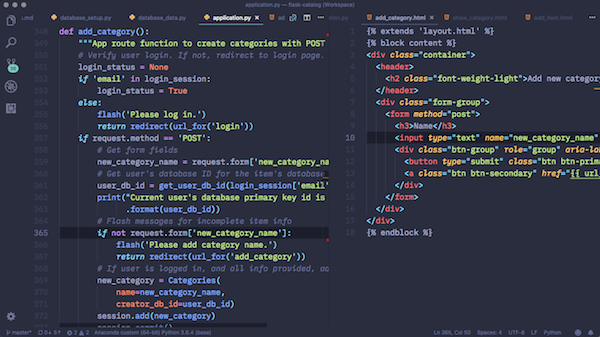

    2. **Creating an object to retrieve the user's database ID.** I wasn't sure how to do this at first. I needed to use `login_session(user_id)` to query the database, and return the user's `id` (their primary key in the SQLite database), so that it can be added to the database when the category is created. I created a `get_db_id(user_id)` function, meaning that it accepts `login_session(user_id)` as an argument and returns the primary key `id` from the database.
  - Git commit at this point: Enable addition of categories f449368

### Edit and delete categories

- I created an app route function for editing categories, and another for deleting categories, with the corresponding HTML templates.
- For these app route functions, I needed to verify both the database id of the user currently logged in, and the database id of the creator of the category. The current user's id was easy because I had already written code for that in the `add_category()` function. The creator's id was more difficult to obtain. Eventually, I realized that I was querying the database for all information on the category to edit, and then attempting to pass `category` to `get_category_creator_db_id` as an argument, when I just needed the name. I changed `category` to `category.name`, and got the expected output from my print debugging statements in the terminal.

  ```python
  creator_db_id = get_category_creator_db_id(category.name)
  ```

  ```text
  Current user's database primary key id is 1.
  Category creator's database primary key id is 1.
  ```

- The next challenge when editing categories was figuring out how to write the edit to the database. SQLAlchemy only has `session.add()` and `session.delete()` commands. I originally had `session.add()` for the `edit_category()` function, but this was adding a new category instead of editing one.
- I referred to the [SQLAlchemy docs](http://docs.sqlalchemy.org/en/latest/orm/tutorial.html#adding-and-updating-objects) and my notes from the Full Stack Foundations CRUD lesson in *fsf-1-crud.md*.
- There is a four step process:
    1. Query database with SQLAlchemy and store query as an object
    2. Overwrite the information in the object with the new information to add to the database
    3. Add to SQLAlchemy database session with `session.add()`.
    4. Commit to SQLAlchemy database session with `session.commit()`.
- I made a few minor adjustments to the code and it worked!
- I only had to make minor modifications to the `edit_category(category)` function to create the `delete_category(category)` function.
  - When deleting a category, I decided to also delete all the items in the category. Otherwise, the item doesn't have a category, and clicking on it throws a SQLAlchemy error.
  - I originally had a form field on the delete category page, where the user would verify the name of the category to be deleted (like on GitHub). This worked when the name was spelled correctly (case-sensitive), but was throwing an error when the name was not spelled correctly or missing. I suspect this was because it was trying to build the `url_for('delete_category')` with the incorrect name, but I'm not sure. I could redirect back to the previous page. I decided to just simplify it and remove the form field. Clicking delete sends the POST request.

### Add items

- I expanded on the `add_category()` function to create the `add_item()` function. The function doesn't require an argument, because it's creating a new database entry from nothing.
- Again, the two keys here were to match form field names in the *application.py* Python code with the `<input>` field names in the *add_item.html* template (see [notes on adding categories above](#add-categories)).

  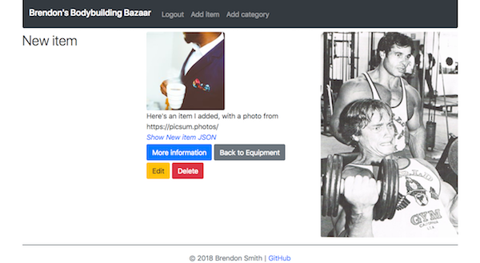

### Edit and delete items

- The challenge when writing the `edit_item()` function was to selectively edit the item's database entry. If the user only wants to edit the name, retrieve the new name or else leave the entry the same.
- I accomplished this by using SQLAlchemy to query the database for the item's information, then using if... else statements. If info was submitted through the form fields in the HTML template, then update, else just use the current info.

  ```python
    item = (session.query(Items)
          .filter_by(name=item.replace('-', ' '))
          .one())
  # Get form fields submitted by user, or retain item info
  if request.form['name']:
      name = request.form['name']
  else:
      name = item.name
  ```

- I then set up an object, and sent it to the database

  ```python
  # Overwrite object with new info for database
  edited_item = Items(name=name,
                      url=url,
                      photo=photo_url,
                      description=description,
                      category_id=category_id.id,
                      creator_db_id=user_db_id)
  session.add(edited_item)
  session.commit()
  ```

- It didn't behave quite as expected. The function was just adding a new database entry, instead of overwriting the previous one.
- I realized `edited_item = Items()` was actually referring to the Class function used to created the database table, and not overwriting the `item` object.
- I needed to first store the edits in an object, then overwrite the `item` object with the new info.

  ```python
  # Store edits in an object
  edited_item = Items(name=name,
                      url=url,
                      photo_url=photo_url,
                      description=description,
                      category_id=category_id.id,
                      creator_db_id=user_db_id)
  # Overwrite item object with new info from edited_item object
  item.name = edited_item.name
  item.url = edited_item.url
  item.photo_url = edited_item.photo_url
  item.description = edited_item.description
  item.category_id = edited_item.category_id
  session.add(item)
  session.commit()
  ```

- As with `delete_category(category)` app route function, I simplified the `delete_item(category, item)` function by removing the form field from `delete_item.html` and having the delete button directly submit the POST request.

### Revisiting database population

- I had previously just hardcoded a dummy user into *database_data.py* for the sake of example. Instead of creating a dummy user, or hardcoding the user's actual name and email, I wanted to prompt the user for their info. This would allow the user to edit the database entries after running *database_data.py*.
- I was able to get the `input()` prompts and database addition done fairly easily.
- The user input could be a problem if the user has logged into the app before running *database_data.py*. In this case, the user would be in the database, but running *database_data.py* would add them again. The program needs to query the database for the users, and only add the user if they're not in the database.
- Adding this condition was a little difficult. As before, I struggled to understand what type of data SQLAlchemy was retrieving from the database.
- I tried to query the database with the [`exists()` method](http://docs.sqlalchemy.org/en/latest/orm/query.html#sqlalchemy.orm.query.Query.exists), which is supposed to return a simple Boolean `True` if the entry is found in the database.
- I had to iterate on this for a while, just hammering away repeatedly.
- There were **two keys** to getting this working:
      1. Selecting just one column from a database table in the format `session.query(Table.column)`. In this case, `session.query(Users.email)`.
      2. Basing the `if` statement simply on existence of the object, rather than trying to extract information from the object. In this case, `if user_email_in_db:`
- The successful code looked like this:

  ```python
  # User
  # Request input from user
  print("Provide credentials to be used when populating the database")
  user_name = input('Please enter your name: ')
  user_email = input('Please enter your email address: ')
  # Query database for user email
  user_email_in_db = (session.query(Users.email)
                      .filter_by(email=user_email)
                      .all())
  if user_email_in_db:
      print('User {} already in database'.format(user_email))
      user = Users(name=user_name, email=user_email)
  else:
      # Create new user
      new_user = Users(name=user_name, email=user_email)
      session.add(new_user)
      session.commit()
      print('User {} successfully added to database.'.format(new_user.email))
      user = new_user
  ```

- Next, I wanted to build in a similar check for the categories and items being added to the database. I set up helper functions to check the database for the category or item. I then renamed each category object to "category", and each item object to "item", to simplify the code.
- The result was a smashing success! If the database has already been populated, no duplicates are added, and the user is notified in the terminal.

  ```text
  vagrant@vagrant:/vagrant/flask-catalog$ python3 database_setup.py
  Database created.

  vagrant@vagrant:/vagrant/flask-catalog$ python3 database_data.py

  Provide credentials to be used when populating the database
  Please enter your name: Brendon Smith
  Please enter your email address: brendon.w.smith@gmail.com
  User brendon.w.smith@gmail.com successfully added to database.
  Category "Equipment" added to database.
  Category "Accessories" added to database.
  Item "Hoist Dual Action Leg Press" added to database.
  Item "Hoist Power Cage" added to database.
  Item "Pro Monster Mini Resistance Band" added to database.
  Item "Fat Gripz" added to database.
  Item "RumbleRoller" added to database.
  Item "SlingShot Hip Circle 2.0" added to database.
  Database population complete.

  vagrant@vagrant:/vagrant/flask-catalog$ python3 database_data.py

  Provide credentials to be used when populating the database
  Please enter your name: Brendon Smith
  Please enter your email address: brendon.w.smith@gmail.com
  User brendon.w.smith@gmail.com already in database
  Category "Equipment" already in database.
  Category "Accessories" already in database.
  Item "Hoist Dual Action Leg Press" already in database.
  Item "Hoist Power Cage" already in database.
  Item "Pro Monster Mini Resistance Band" already in database.
  Item "Fat Gripz" already in database.
  Item "RumbleRoller" already in database.
  Item "SlingShot Hip Circle 2.0" already in database.
  Database population complete.

  vagrant@vagrant:/vagrant/flask-catalog$
  ```

[(Back to top)](#top)

## Comments

**The lessons didn't prepare me to build the app, which made this a struggle. I didn't have a good grasp of:**

- [SQLAlchemy](http://www.sqlalchemy.org/): What type of data the query would return, and how to extract from it.
- [Jinja](http://jinja.pocoo.org/docs/2.10/)
- [Rendering templates](http://flask.pocoo.org/docs/0.12/quickstart/#rendering-templates)
- [URL building with `url_for`](http://flask.pocoo.org/docs/0.12/quickstart/#url-building)

**In general, I found it difficult to:**

- Build the app in a systematic way.
- Keep the application code structured. **Flask didn't seem to scale well.**
- Coordinate changes among the functions, app routes, and templates.
- Follow all the similar variable names being used everywhere.
- Debug. It would be helpful to be able to debug on the command line at any point, not just when there is an error. I couldn't really follow the [instructions for the Flask CLI](http://flask.pocoo.org/docs/0.12/cli/). I built many `print()` statements into *application.py* to help with debugging.
- Integrate Flask and JavaScript. As much as I appreciate Python, it seems like I'm just avoiding JavaScript and should just be coding everything in JavaScript instead of Python.
- Keep in mind that Flask is only at version 0.12. It needs more development.

It would have been **better to build the app according to the agile iterative development process** lesson (see [my notes on the agile lesson](https://github.com/br3ndonland/udacity-fsnd/blob/master/4-web-apps/full-stack-foundations/fsf-4-agile.md)), but the lessons were so poorly organized that I didn't really think about it, and the [introductory info for this project](#info) didn't even mention the agile lesson.

**Time commitment:**

- It took ~50 hours over a week (end of March 2018) to build the initial version of the app (up to the :face_palm: stage).
- It took ~30 hours to debug the pages and JSON.
- It took ~70 hours to debug the login.
- It took ~50 hours for further debugging.

[(Back to top)](#top)

## Review

See [flask-catalog-review.md](flask-catalog-review.md). I got the Udacity code review back within a few hours. I passed with no corrections needed! The reviewer said, "I really commend you for this project." YES!

## Post-review

- Added review to repo and updated links in README
- Added vscode debug configuration to enable running and debugging of the app within vscode
- Moved the Google Sign-In button to the navbar. I had to pass the client id and state to all the pre-login pages, so that the user could log in from any page.
- I also wanted to remove the inline JavaScript. After moving the JavaScript to a separate file, it could no longer use Jinja, so `url: '/gconnect?state={{ STATE }}',` and `window.location.href = "{{ url_for('home') }}"` return those strings literally, without reading the variables passed into the HTML from Python. I found a [response on Stack Overflow](https://stackoverflow.com/a/42158426/8921994) to ["How can I pass data from Flask to JavaScript in a template?"](https://stackoverflow.com/questions/11178426/how-can-i-pass-data-from-flask-to-javascript-in-a-template#11178486) that suggested defining the variable with an inline script prior to sourcing the external script.

### Virtual environment

#### pipenv

- Pipenv was very easy to set up. [Kenneth Reitz's pipenv docs](https://docs.pipenv.org/) and the [thoughtbot blog post](https://robots.thoughtbot.com/how-to-manage-your-python-projects-with-pipenv) helped me get up and running in a few minutes.

  ```shell
  pip install pipenv
  cd <path>/udacity-fsnd-p4-flask-catalog
  pipenv install --three
  pipenv install flask
  pipenv install requests
  pipenv install sqlalchemy
  pipenv shell
  ```

- I started getting strange namespace errors from Pipenv after updating to Python 3.6.5 and Flask 1.0.2. See [pipenv-error-traceback.md](info/pipenv-error-traceback.md) for details. I switched to `venv` as a more stable alternative.

#### venv

- Python 3 is bundled with the `venv` module for creation of virtual environments. It is no longer necessary to `pip install virtualenv`.
- See the [Python 3 venv tutorial](https://docs.python.org/3/tutorial/venv.html) and the [Flask 1 docs](http://flask.pocoo.org/docs/1.0/installation/).

  ```shell
  cd <PATH>
  python3 -m venv venv
  # activate virtual env
  . venv/bin/activate
  # install required modules within virtual env
  (venv) <PATH> pip install flask
  (venv) <PATH> pip install requests
  (venv) <PATH> pip install sqlalchemy
  (venv) <PATH> pip install oauth2client
  # generate list of packages
  (venv) <PATH> pip freeze > requirements.txt
  ```

- Once requirements.txt has been generated, future installations are simpler:

  ```shell
  cd <PATH>
  python3 -m venv venv
  # activate virtual env
  . venv/bin/activate
  # install modules listed in requirements.txt
  (venv) <PATH> pip install -r requirements.txt
  ```

### Docker container

- vscode has a [Docker extension](https://github.com/microsoft/vscode-docker) and a helpful guide to [working with Docker in vscode](https://code.visualstudio.com/docs/azure/docker).
- I also went through the [Docker getting started docs](https://docs.docker.com/get-started), which actually feature a simple Flask app.
- I opened the command palette and ran "Docker: Add Docker files to Workspace," which generated my *Dockerfile*, *docker-compose.yml*, and *docker-compose.debug.yml*.
- The auto-generated files weren't completely correct. I updated the *Dockerfile* with correct info.
- I had to update the application files to work with Docker. I previously had a terminal prompt for user info when populating the database. Docker needs this info. I added environment variables to the *Dockerfile*. I then modified the *database_data.py* and *application.py* modules to read the environment variables.
- I built and ran the container:

  ```sh
  docker build -t catalog .
  docker run -d -p 80:80 catalog:latest
  ```

- The running container was visible at [http://localhost:80](http://localhost:80).

[(Back to top)](#top)
