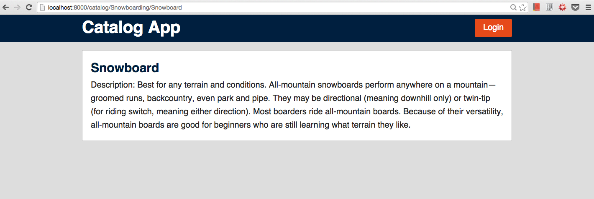
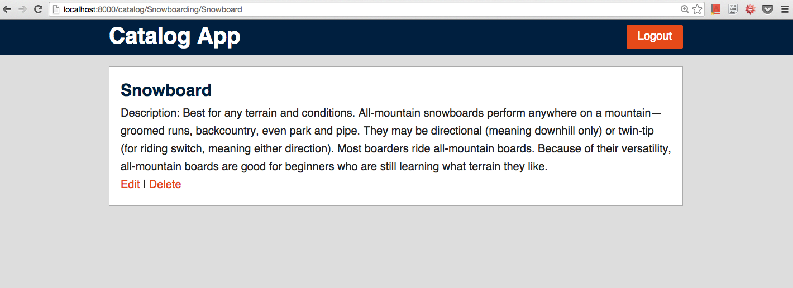
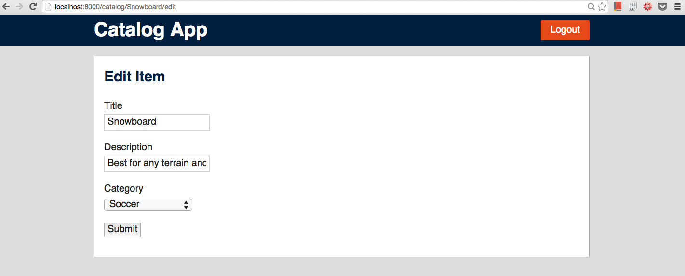
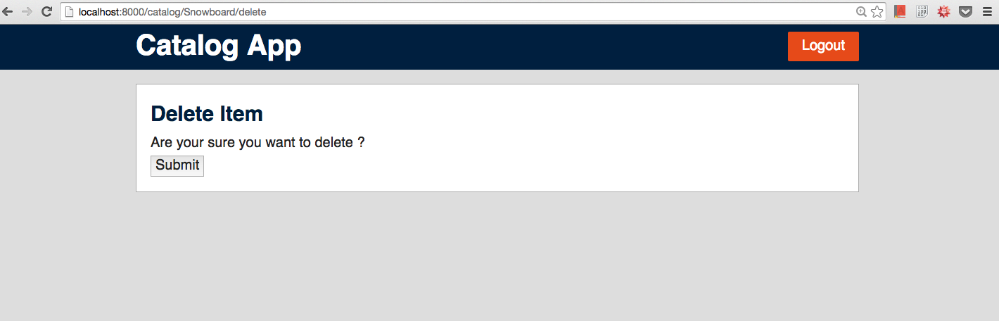

# Udacity documentation

Udacity Full Stack Web Developer Nanodegree program

[Project 4. Flask Item Catalog App](https://github.com/br3ndonland/udacity-fsnd03-p02-flask-catalog)

Brendon Smith

br3ndonland

## Table of Contents

- [Table of Contents](#table-of-contents)
- [Project Overview](#project-overview)
  - [Why This Project](#why-this-project)
  - [What Will I Learn](#what-will-i-learn)
  - [How Does This Help My Career](#how-does-this-help-my-career)
- [Project Display Example](#project-display-example)
- [Project Details](#project-details)
  - [How will I complete this project](#how-will-i-complete-this-project)
- [Project Submission](#project-submission)
  - [Evaluation](#evaluation)
  - [Submission](#submission)
  - [Next Steps](#next-steps)
- [Project Specification Rubric](#project-specification-rubric)
  - [API Endpoints](#api-endpoints)
  - [CRUD: Read](#crud-read)
  - [CRUD: Create](#crud-create)
  - [CRUD: Update](#crud-update)
  - [CRUD: Delete](#crud-delete)
  - [Authentication & Authorization](#authentication-authorization)
  - [Code Quality](#code-quality)
  - [Comments](#comments)
  - [Documentation](#documentation)
  - [Suggestions to Make Your Project Stand Out](#suggestions-to-make-your-project-stand-out)

## Project Overview

You will develop an application that provides a list of items within a variety of categories as well as provide a user registration and authentication system. Registered users will have the ability to post, edit and delete their own items.

### Why This Project

Modern web applications perform a variety of functions and provide amazing features and utilities to their users; but deep down, it’s really all just creating, reading, updating and deleting data. In this project, you’ll combine your knowledge of building dynamic websites with persistent data storage to create a web application that provides a compelling service to your users.

### What Will I Learn

You will learn how to develop a RESTful web application using the Python framework Flask along with implementing third-party OAuth authentication. You will then learn when to properly use the various HTTP methods available to you and how these methods relate to CRUD (create, read, update and delete) operations.

### How Does This Help My Career

- Efficiently interacting with data is the backbone upon which performant web applications are built
- Properly implementing authentication mechanisms and appropriately mapping HTTP methods to CRUD operations are core features of a properly secured web application

[(Back to TOC)](#table-of-contents)

## Project Display Example

**Note: The screenshots on this page are just examples of one implementation of the minimal functionality. You are encouraged to redesign and strive for even better solutions.**

The Item Catalog project consists of developing an application that provides a list of items within a variety of categories, as well as provide a user registration and authentication system.

In this sample project, the homepage displays all current categories along with the latest added items.

- App homepage
  - [Homepage](http://localhost:8000/):
    
- Selecting a specific category shows you all the items available for that category.
  - [Category page](http://localhost:8000/catalog/Snowboarding/items)
    
- Selecting a specific item shows you specific information of that item.
  - [Item page](http://localhost:8000/catalog/Snowboarding/Snowboard)
    
- After logging in, a user has the ability to add, update, or delete item info.
  - [Homepage after login](http://localhost:8000/) (logged in)
    
  - [View item page after login](http://localhost:8000/catalog/Snowboarding/Snowboard)
    
  - [Edit item page after login](http://localhost:8000/catalog/Snowboard/edit)
    
  - [Delete item page after login](http://localhost:8000/catalog/Snowboard/delete)
    
- The application provides a JSON endpoint, at the very least.
  - [Catalog JSON](http://localhost:8000/catalog.json)
    

[(Back to TOC)](#table-of-contents)

## Project Details

### How will I complete this project

This project is connected to the [Full Stack Foundations](https://classroom.udacity.com/courses/ud088) and [Authentication and Authorization](https://classroom.udacity.com/courses/ud330) courses, but depending on your background knowledge you may not need the entirety of both courses to complete this project. Here's what you should do:

1. Install Vagrant and VirtualBox
2. Clone the fullstack-nanodegree-vm
3. Launch the Vagrant VM (vagrant up)
4. Write your Flask application locally in the vagrant/catalog directory (which will automatically be synced to /vagrant/catalog within the VM).
5. Run your application within the VM (python /vagrant/catalog/application.py)
6. Access and test your application by visiting [http://localhost:8000](http://localhost:8000) locally

Get started with this helpful [guide](https://docs.google.com/document/d/1jFjlq_f-hJoAZP8dYuo5H3xY62kGyziQmiv9EPIA7tM/pub?embedded=true).

[(Back to TOC)](#table-of-contents)

## Project Submission

You will develop an application that provides a list of items within a variety of categories as well as provide a user registration and authentication system. Registered users will have the ability to post, edit and delete their own items.

### Evaluation

Your project will be evaluated by a Udacity Code Reviewer according to the rubric below. Be sure to review it thoroughly before you submit. All criteria must "meet specifications" in order to pass.

[Click here to view the rubric](https://review.udacity.com/#!/projects/3487760229/rubric)

### Submission

When you're ready to submit your project, click [here](https://review.udacity.com/#!/projects/3487760229) and follow the instructions. Due to the high volume of submissions we receive, please allow up up to **7 business days** for your evaluation to be returned.

If you are having any problems submitting your project or wish to check up on the status of your evaluation, please email us at **fullstack-project@udacity.com**.

### Next Steps

You will get an email as soon as your reviewer has feedback for you. In the meantime, review your next project and feel free to get started on it or the courses supporting it!

[(Back to TOC)](#table-of-contents)

## Project Specification Rubric

Item Catalog

### API Endpoints

Criteria

Meets Specifications

Does the project implement a `JSON endpoint` with all required content?

The project implements a `JSON endpoint` that serves the same information as displayed in the `HTML endpoints` for an arbitrary item in the catalog.

### CRUD: Read

Criteria

Meets Specifications

Does the website read category and item information from a database?

Website reads category and item information from a database.

### CRUD: Create

Criteria

Meets Specifications

Does the website include a form allowing users to add new items and correctly processes these forms?

Website includes a form allowing users to add new items and correctly processes submitted forms.

### CRUD: Update

Criteria

Meets Specifications

Does the website include a form to update a record in the database and correctly processes this form?

Website does include a form to edit/update a current record in the database table and correctly processes submitted forms.

### CRUD: Delete

Criteria

Meets Specifications

Does the website include a way to delete an item from the catalog?

Website does include a function to delete a current record.

### Authentication & Authorization

Criteria

Meets Specifications

Do create, delete, and update operations consider authorization status prior to execution?

Create, delete and update operations do consider authorization status prior to execution.

Does the website implement a third party authentication and authorization service?

Page implements a third-party authentication & authorization service (like `Google Accounts` or `Mozilla Persona`) instead of implementing its own authentication & authorization spec.

Is there a “login” and “logout” button/link in the website?

Make sure there is a 'Login' and 'Logout' button/link in the project. The aesthetics of this button/link is up to the discretion of the student.

### Code Quality

Criteria

Meets Specifications

Is the code ready for personal review and is neatly formatted?

Code is ready for personal review and neatly formatted and compliant with the Python [PEP 8](https://www.python.org/dev/peps/pep-0008/) style guide.

### Comments

Criteria

Meets Specifications

Are comments present and effectively explain longer code procedures?

Comments are present and effectively explain longer code procedures.

### Documentation

Criteria

Meets Specifications

Is there a `README` file included detailing all steps required to successfully run the application?

`README` file includes details of all the steps required to successfully run the application.

### Suggestions to Make Your Project Stand Out

- Add `CRUD` functionality for image handling.
- Implement `CSRF` protection on your `CRUD` operations.

[(Back to TOC)](#table-of-contents)